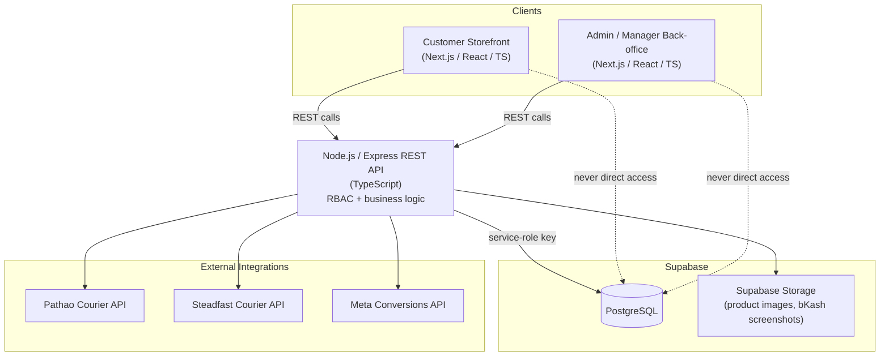

# System Overview

## 1. System Overview

The proposed system is a **Bangladesh-focused fashion and clothing e-commerce platform** designed to support online shopping, product management, order processing, manual payment verification, customer management, analytics, and courier shipment management.

The platform will support integration with courier services such as **Pathao** and **Steadfast** for shipment processing and order delivery.

The system consists of two primary interfaces:

1. **Customer Storefront**
2. **Admin / Manager Back-office**

---

## 1.1 Technology Stack

The following stack is fixed for this project. Implementation must follow it; do not introduce another database or backend framework unless absolutely required.

**Frontend**

- Next.js
- React
- TypeScript (not JavaScript)
- Tailwind CSS

**Backend**

- Node.js
- Express.js
- TypeScript (not JavaScript)
- REST API

**Database**

- PostgreSQL (not MongoDB)
- Supabase as the PostgreSQL database platform
- All application access to the database goes through the Node.js/Express backend using the Supabase service-role key; the browser/Next.js client never talks to Supabase directly with an end-user-scoped key. Authorization (customer vs. admin/manager RBAC, per Section 5) is enforced in the Express layer per Section 5.15's authorization flow. Supabase Row Level Security is not relied upon as the authorization mechanism under this access pattern.

**Storage**

- Supabase Storage for product images and other uploaded files (e.g. bKash payment screenshots)

**SEO** (via Next.js)

- Server-side rendering / static generation where appropriate
- Metadata API
- Dynamic product and category metadata
- Sitemap and robots.txt
- Canonical URLs
- Open Graph metadata
- JSON-LD structured data
- SEO-friendly URLs

The architecture must stay simple, scalable, and suitable for a production clothing e-commerce site — no speculative infrastructure beyond what this stack requires.

**Diagram:**

---

## Requirements Index

| File | Sections | Covers |
| --- | --- | --- |
| [01-overview.md](01-overview.md) | 1, 1.1 | System overview, technology stack (this file) |
| [02-customer.md](02-customer.md) | 2.x | Customer storefront: optional registration, profile, login, password recovery, guest checkout and guest order lookup by Order Number + Phone Number (2.9), admin/manager account creation |
| [03-payment-order.md](03-payment-order.md) | 3.x | Payment methods (bKash, COD), order confirmation flow, failure handling — UI-level status narrative |
| [04-courier-shipment.md](04-courier-shipment.md) | 4.x | Courier selection, shipment creation, public Track Order feature (4.7, 4.14), courier service abstraction, failure handling |
| [05-admin-operations.md](05-admin-operations.md) | 5.1–5.9 | Catalogue, order, customer, content management; analytics and business reports |
| [06-rbac.md](06-rbac.md) | 5.10–5.19 | Role hierarchy (Admin/Manager), permission rules, complete permission matrix, database-seeded initial Admin |
| [07-order-state-machine.md](07-order-state-machine.md) | 5.21.x | **Authoritative** order/payment/shipment status enums and transition rules |
| [08-analytics-meta.md](08-analytics-meta.md) | 6.x | Meta Pixel + Conversions API (CAPI) integration |
| [09-fraud-risk-check.md](09-fraud-risk-check.md) | 7.x | Courier fraud / customer risk check feature |
| [10-coupon-discount.md](10-coupon-discount.md) | 8.x | Coupon / discount system: admin coupon management, checkout coupon application, discount calculation, usage limits, and integration with orders/payments/courier/analytics |
| [11-security-hardening.md](11-security-hardening.md) | 11.x | Cross-cutting security: rate limiting, DoS/DDoS mitigation, headers/CORS, input validation, auth/session security, payment security, dependency hygiene |
| [12-whatsapp-contact.md](12-whatsapp-contact.md) | 12.x | WhatsApp Click-to-Chat (`wa.me`) button on the product page — pre-filled message, stock-based button pairing, env-var config |
| [13-homepage-cms.md](13-homepage-cms.md) | 13.x | CMS-driven homepage: Homepage Section / Campaign data model, section types, automatic/manual product selection, campaign scheduling, Admin Homepage Builder, RBAC/SEO/analytics integration |

**Note:** Sections 2–4 and 5.1–5.9 use order/payment/shipment status names as UI display labels and narrative diagrams. [07-order-state-machine.md](07-order-state-machine.md) is the single authoritative source for the enforced enum values and valid transitions — implementation must follow that file, not the illustrative diagrams elsewhere.
