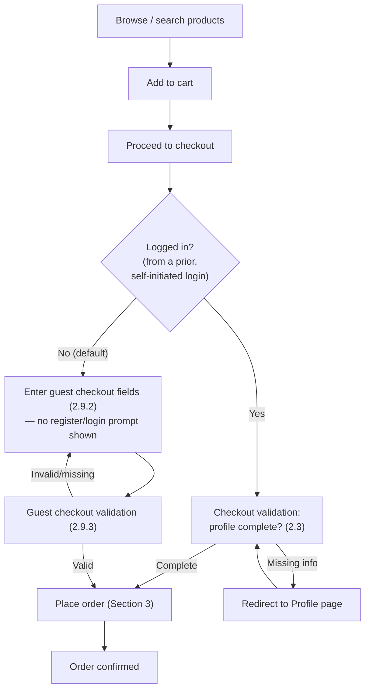
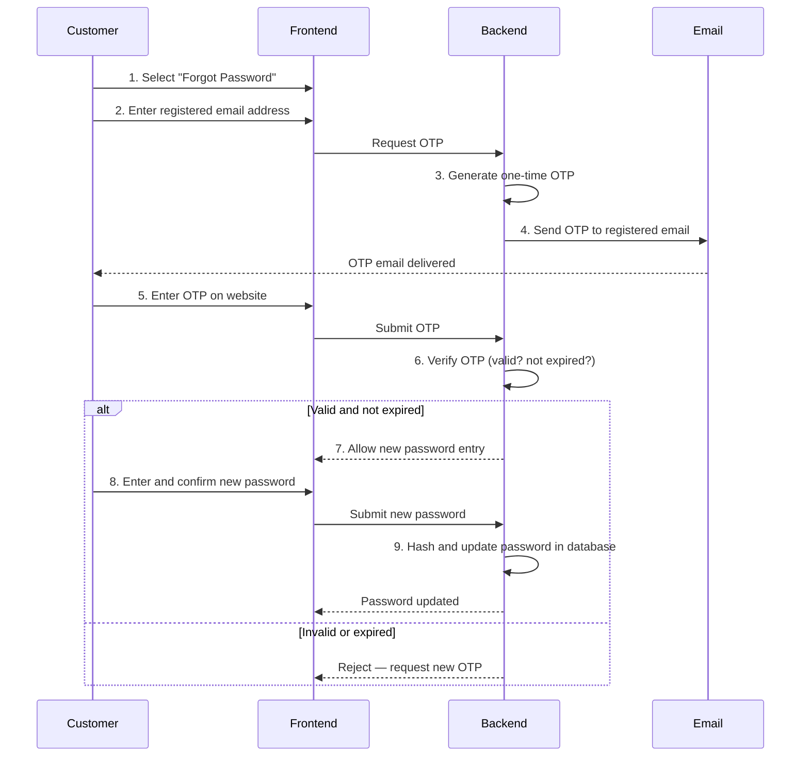
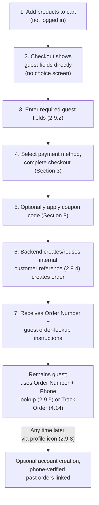
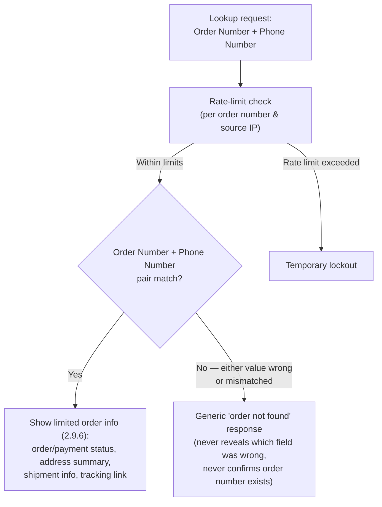

# Requirements — Customer Storefront

> Part of the requirements set — see [01-overview.md](01-overview.md) for the index and technology stack.

## 2. Customer Storefront

Creating a customer account is **optional**. The storefront supports both:

- **Guest checkout (default path)** — the customer browses, adds products to cart, and checks out directly by providing name, phone, and delivery address at checkout, with no registration or login step in the way. This is the default, unprompted checkout path for every customer who has not already logged in — checkout never presents a "Register/Login or Continue as Guest?" choice. The guest can look up their order afterward using the store Order Number + Phone Number (Section 2.9).
- **Registered customers** — a customer who wants an account creates one entirely on their own initiative, at any time, via the **profile icon** in the storefront header — never as a required or offered step inside the checkout flow itself. Once registered and logged in, they get a saved profile, address book, and in-account order history (Sections 2.1–2.6). Registration is discovered and opted into by the customer, not surfaced as a checkout prompt.

Both registered and guest customers also have access to the public **Track Order** feature, which looks up shipment status using the courier-provided Order ID / Tracking ID and requires no login (Section 4.7 and 4.14). Section 2.9's Order Number + Phone Number lookup and the Track Order feature are two distinct, complementary lookup paths — see Section 4.14.1 for how they differ and when each applies.

Both paths place orders into the same order/payment/shipment tables and the same state machine (Section 5.21) — there is no separate guest order system. Where a requirement below says "customer," it applies to both a registered customer and a guest unless the text explicitly says "registered customer only."

The customer-facing application allows customers to:

- Check out directly as a guest with no registration/login step, and optionally register or log in later via the profile icon if they want an account.
- Browse products by category.
- Search and filter products.
- View detailed product information.
- Select product variants such as size, colour, age group, and other available options.
- Purchase products across different categories, including:
  - Men's clothing
  - Women's clothing
  - Children's clothing
  - Adult and children's footwear
  - Sneakers
  - Caps
  - Accessories
  - Other fashion products

- Add products to the shopping cart.
- Add products to a wishlist.
- Manage their profile.
- Add and manage delivery addresses.
- Place orders, as a registered customer or as a guest.
- Apply an optional coupon/discount code at checkout (Section 8, [10-coupon-discount.md](10-coupon-discount.md)).
- Select the available payment method.
- Make payment using manual **bKash Send Money**.
- Submit the bKash transaction information during or after checkout.
- Receive order-status updates.
- View order history (registered customers, in-account) or look up a single order (guests, via Order Number + Phone Number — Section 2.9).
- Use the public **Track Order** feature (guest or registered) to check shipment status using the courier-provided Order ID / Tracking ID, without logging in (Section 4.7, 4.14).
- View the current status of an order.
- View courier and Parcel ID information when available.

**Diagram:**

**Checkout never gates on account creation.** The "Logged in?" branch above only exists because a customer *may* already be logged in from a session they started earlier, entirely on their own initiative, via the profile icon (Section 2.1, 2.4) — checkout itself never asks the customer to register, log in, or "continue as guest." A customer who is not logged in always lands directly on the guest checkout fields (Section 2.9.2), with no intermediate choice screen.

---

### 2.1 Customer Registration

- Creating an account is optional. A customer may register before ordering, may register after completing a guest order (Section 2.9.8), or may never register and always check out as a guest.
- Customer registration, when a customer chooses to register, must require:
  - Mobile phone number
  - Password
- The mobile phone number must be unique.
- A customer cannot create multiple accounts using the same mobile phone number.
- Passwords must never be stored as plain text.
- Passwords must be securely hashed before being stored in the database.

### 2.2 Customer Profile Requirements (Registered Customers)

Before a **registered, logged-in** customer can place an order, the following information must exist in their profile:

- Full name
- Mobile phone number
- Email address(optional)
- Division
- District
- Upazila / Thana (Upazila for rural areas; Thana for metropolitan areas such as Dhaka, where Thana is the equivalent administrative unit)
- Union / Ward (Union for rural areas; Ward for urban/city-corporation areas)
- Detailed address
- Postal code(optional)

**Note:** "Upazila / Thana" and "Union / Ward" each represent one field with two possible naming conventions depending on whether the address is rural or metropolitan — not two separate fields, and not interchangeable synonyms. The stored value must record which convention applies (e.g. a type discriminator) so it can be mapped correctly to each courier's own address schema (Section 4.2).

The registered customer's mobile number and complete delivery address must be available before checkout.

A customer who is not logged in is not required to have a profile at all — they check out as a guest and supply the equivalent fields directly at checkout (Section 2.9.2), using the same address model described above.

### 2.3 Checkout Validation

When a customer attempts to proceed with checkout or place an order, the validation path depends on whether they are checking out as a registered, logged-in customer or as a guest.

**Registered customer (logged in):**

The system must check whether all required customer profile information (Section 2.2) is available.

- **If all required information is complete:** allow the customer to continue with checkout and place the order according to the normal order flow.
- **If any required information is missing:** do not allow the customer to place the order; redirect the customer to the Profile page; clearly identify the missing required information; require the customer to complete it; after completing the required information, allow the customer to return to checkout and continue the order.

**Guest (not logged in):**

The system must check whether all required guest checkout fields (Section 2.9.2) were submitted with the checkout request, in the same order defined in Section 2.9.3.

- **If all required fields are complete and valid:** allow the guest to place the order according to the normal order flow (Section 2.9).
- **If any required field is missing or invalid:** do not allow the order to be placed; return the specific missing/invalid field(s) to the checkout form so the guest can correct them and resubmit. There is no profile page to redirect a guest to — the correction happens inline on the checkout form.

In both cases, this validation must be enforced on the backend as well as the frontend. Frontend validation alone must never be relied upon for order eligibility (see Section 3, which re-runs this same branch server-side before creating the order record).

### 2.4 Customer Login

Customers must log in using:

- Mobile phone number
- Password

After successful authentication, the system must create a secure authenticated customer session using an httpOnly, signed session token (JWT or equivalent) with a defined expiry and refresh mechanism. Customer sessions and admin/manager sessions (section 5) must use separate token scopes so a customer session can never be used to access back-office endpoints, and vice versa.

Login attempts must be rate-limited per account and per source IP to prevent brute-force credential guessing, using the same limiting approach specified for OTP requests in section 2.5.

### 2.5 Forgot Password

Customers must be able to recover their password using their registered email address.

Because email is only required as part of profile completion (section 2.2), not at registration (section 2.1), a customer who has registered but never completed their profile has no email on file and cannot use this flow until an email address is added to their account. This is an accepted constraint: password recovery in v1 is email-based only, with no alternate recovery channel.

**Password Recovery Flow**

1. Customer selects Forgot Password.
2. Customer enters the email address associated with their account.
3. The system generates a one-time OTP.
4. The OTP is sent to the customer's registered email address.
5. Customer enters the OTP on the website.
6. The system verifies the OTP.
7. If the OTP is valid and has not expired, the customer can create a new password.
8. Customer enters and confirms the new password.
9. The system securely hashes and updates the new password in the database.

**Password Recovery Security**

- OTPs must expire after a limited period (default: 10 minutes).
- Each OTP must be single-use.
- Limit repeated OTP requests (default: max 3 OTP requests per account per 15-minute window).
- Limit incorrect OTP attempts (default: max 5 incorrect attempts per issued OTP before it is invalidated and a new one must be requested).
- Passwords must never be stored as plain text.
- The system must not expose sensitive account information through error messages.

These default thresholds apply equally to the login rate limiting described in section 2.4, which reuses this same limiting approach. They are configurable business parameters, not fixed architecture, and may be tuned after launch without changing the underlying mechanism.

**Diagram:**

### 2.6 Customer Profile Management

Customers must be able to:

- View their profile.
- Edit their profile.
- Update their mobile phone number according to the system's verification rules.
- Update their email address according to the system's verification rules.
- Update their delivery address.
- Change their password.
- View their order history.

### 2.7 Admin Account

The system must have an initial administrator account, created via a database seed script at first deployment (see Section 5.12.1). There is no back-office UI workflow for creating this account.

Bootstrap credentials (the seed User ID and Password) are supplied to the seed script through environment variables (e.g. `SEED_ADMIN_USER_ID`, `SEED_ADMIN_PASSWORD`), never hard-coded. For local reference only, out-of-band bootstrap values may be kept in `.secrets/seed-credentials.md` (gitignored, local only) — never in this document, in source control, or in any other tracked file.

The administrator must have access to the administrative system and the permissions required to manage the website.

This seed account is created with the **Admin** role (the top of the role hierarchy defined in Section 5.10–5.19) and is the protected, non-deletable account described in Section 5.12.3. There is no "Super Admin" role — Admin is the highest administrative role, and only one Admin account is created by the seed process.

> **Note:** The admin password must be changed on first login. Seed credentials must never be committed to source control or documentation intended for wider distribution.

### 2.8 Manager Accounts

The Admin can create Manager accounts later through the back-office account-management interface.

For each manager, the Admin can assign:

- User ID
- Password

Each manager account must be separate from the administrator account.

Creation and management of Manager accounts follows the full role hierarchy and permission rules defined in Section 5.10–5.19. Only the Admin can create, update, deactivate, or delete Manager accounts, per the permission matrix in Section 5.18. There is no Staff role and no Manager-to-Manager account management.

---

### 2.9 Guest Checkout and Guest Order Lookup (Order Number + Phone Number)

Guest checkout lets a customer place an order without registering or logging in. A guest order is stored in the exact same orders/payments/shipments tables as a registered customer's order and follows the exact same order state machine (Section 5.21) — there is no parallel guest order system, no separate guest order table, and no reduced set of order statuses for guests.

**Relationship to the public Track Order feature (Section 4.14):** This section defines a guest **order lookup** by the store's own Order Number + Phone Number — useful when the guest has their order confirmation but not yet a courier tracking identifier, or wants full order/payment detail rather than just shipment status. It is a separate capability from the public **Track Order** feature (Section 4.14), which looks up shipment status using the courier-provided Order ID / Tracking ID and needs no phone number. Both are available to guests; a guest is never required to use one over the other. See Section 4.14.1 for the full comparison.

#### 2.9.1 Guest Checkout Flow

1. Customer adds products to cart without logging in.
2. Customer proceeds to checkout and lands directly on the guest checkout fields — there is no "Continue as Guest" choice to make; this is simply what checkout looks like when no one is logged in.
3. Customer enters the required guest fields (Section 2.9.2) directly on the checkout page.
4. Customer selects a payment method and completes checkout per the normal flow (Section 3).
5. Customer may optionally enter and apply a coupon code before placing the order (Section 8, [10-coupon-discount.md](10-coupon-discount.md)) — this works identically for guests and registered customers and never requires an account.
6. On order placement, the backend creates or reuses an internal customer reference for the guest (Section 2.9.4) and creates the order against it, including revalidating and applying any coupon (Section 8.15b).
7. The customer receives an Order Number and is shown/sent the guest order-lookup instructions (Section 2.9.5–2.9.6), and is told that once a courier shipment is created they can also use the public Track Order page (Section 4.14) with the courier-provided ID sent by SMS.

**Diagram:**

#### 2.9.2 Required Guest Fields

A guest checkout must collect the same information a registered customer's profile provides, entered directly at checkout instead of read from a saved profile:

- Full name
- Bangladesh mobile phone number
- Email address (optional)
- Division
- District
- Upazila / Thana (per the same rural/metropolitan discriminator defined in Section 2.2)
- Union / Ward (per the same rural/metropolitan discriminator defined in Section 2.2)
- Detailed address
- Postal code (optional)

This is the same address model used for registered customers (Section 2.2) — guest orders must not use a different or reduced address schema, since the same courier address mapping (Section 4.2) and the same admin/manager order views (Section 5.3–5.4) must work identically for both.

#### 2.9.3 Guest Checkout Backend Validation Order

On submission, the backend validates a guest checkout request in this order, failing fast and returning the specific invalid/missing field(s) at whichever step fails:

1. Required-field presence check (all fields in Section 2.9.2 except the optional ones are present).
2. Bangladesh phone number format validation.
3. Address structure validation (Division/District/Upazila-Thana/Union-Ward consistency, per the type discriminator in Section 2.2).
4. Email format validation, only if an email was provided.
5. Cart/order content validation (items still available, prices current), same as the registered-customer flow.
6. Payment-method-specific validation (Section 3.1 for bKash, Section 3.2 for COD) — identical rules for guest and registered orders.

This mirrors, for guests, the same backend re-validation principle Section 2.3 and Section 3 require for registered customers: frontend validation is never sufficient on its own.

#### 2.9.4 Guest Order Data Retained / Internal Customer Reference

- A guest order needs an internal customer reference so it can be linked to order history, risk checks (Section 7), and admin/manager customer views (Section 5.7) the same way a registered customer's orders are.
- The backend creates (or, if a customer record with the same phone number already exists as a guest reference, reuses) a customer record holding the guest's name, phone, email (if given), and delivery address, marked with a guest/registered discriminator (e.g. `account_type: GUEST` vs `REGISTERED`, or a null `password_hash`/`auth_identity` on the record).
- Creating this internal reference must **not** create login credentials, a password, or any authentication identity. A guest record has no password and cannot be used to log in until the guest deliberately completes account creation (Section 2.9.8).
- All order, payment, and shipment data for a guest order is recorded exactly as it would be for a registered customer's order — same fields, same tables, same state machine.

#### 2.9.5 Guest Order Lookup — Verification

Because a guest has no account/session to prove ownership of an order, looking up a guest order by store Order Number requires presenting two pieces of information together:

- **Order Number**, and
- **Phone Number** used on that order.

The backend looks up the order by this (order number, phone number) pair. Neither value alone is sufficient to view order details. A registered customer instead sees their orders directly in their account (Section 2.6), with no separate lookup step needed. Unlike this lookup, the public Track Order feature (Section 4.14) requires only the courier-provided identifier and no phone number — see Section 4.14.1 for why the two features have different verification requirements.

#### 2.9.6 Guest Order Lookup Page Contents

Once verified, the guest order-lookup page shows the same category of information a registered customer sees for their own order (Section 4.7), specifically:

- Order status (per the customer-facing display labels in Section 3.7)
- Payment status (per Section 3.6)
- Delivery/shipping address summary
- Shipment information: courier name, Parcel ID/Tracking ID, and shipment status, when a shipment exists
- A courier tracking link, when the selected courier exposes one and a shipment has been created

The guest order-lookup page must **not** expose: internal admin/manager notes, fraud/risk-check results (Section 7), payment proof (uploaded bKash screenshots or full Transaction ID beyond what's needed to confirm the order to the guest), or any authentication/session credential.

#### 2.9.7 Guest Order Lookup — Security Rules

- **No sequential/enumerable order-number URLs for lookup.** The lookup page/API must require the (Order Number, Phone Number) pair on every lookup; the Order Number by itself must not function as a bearer token or appear alone in a guessable, sequentially-incrementing lookup URL that returns order details without the phone number check.
- **Rate-limiting on order lookups**, reusing the same OTP-style rate-limiting approach already defined in Section 2.5 (e.g. capped attempts per Order Number and per source IP within a time window, with incorrect-attempt limits before a temporary lockout), to prevent brute-forcing phone numbers against a known/guessed order number or vice versa.
- The lookup response must not expose whether an Order Number exists at all when the phone number does not match it — a mismatched pair returns the same generic "order not found" style response used for a fully invalid Order Number, so the endpoint cannot be used to enumerate valid order numbers.
- No admin-only fields (Section 2.9.6) are ever included in the guest order-lookup response payload, regardless of what the backend/admin data model stores internally.

This lookup and the public Track Order endpoint (Section 4.14) are separate endpoints with separate rate-limiting and validation rules, since they accept different identifiers and expose slightly different data — see Section 4.16 for Track Order's own security rules.

**Diagram:**

#### 2.9.8 Optional Post-Order Account Creation

A guest who has placed one or more orders may optionally create a full registered account at any later time, entirely on their own initiative — the storefront never prompts for this on the order confirmation page, the tracking page, or anywhere else in the checkout/post-checkout flow. The only entry point is the **profile icon** in the storefront header:

1. The guest clicks the profile icon and chooses "Create an account" / "Register."
2. The guest sets a password (and confirms/updates their profile fields per Section 2.2 if desired).
3. The backend associates the new registered account with the existing internal customer reference (Section 2.9.4) used for that guest order — matched by phone number — rather than creating a second, disconnected customer record.
4. The guest's past order(s) placed under that phone number become visible in the new account's order history (Section 2.6).
5. This association must not silently attach a stranger's past orders to a new account: the phone number on the account being created must match the phone number the guest orders were placed under, and the account-creation flow must verify the phone number (e.g. OTP to the phone, or requiring the guest to also supply a matching Order Number) before completing the association, so an attacker cannot claim someone else's guest order history just by registering with their phone number.
6. Once associated, the record's guest/registered discriminator (Section 2.9.4) is updated to `REGISTERED`, and it behaves as a normal registered-customer account from then on.

---

### 2.10 Product Browsing Implementation Notes

This section records implementation decisions made while building "Browse products by category," "Search and filter products," and "View detailed product information" (introductory list above) that were not spelled out elsewhere in this document, so the actual contract is documented rather than left implicit in code.

- **`GET /api/products`** — public, unauthenticated, paginated list of `status = 'ACTIVE'` products only. Supports `categoryId` and `search` (name substring) filters.
- **`GET /api/products/:slug`** — public product detail, looked up by slug (not id), returning category, images, active variants with their attribute values (size/colour/etc.), and computed `outOfStock`/`minPrice`/`maxPrice`. Returns 404 for INACTIVE or nonexistent products — an inactive product is never reachable through this endpoint.
- **`GET /api/categories`** — public, unauthenticated list of `status = 'ACTIVE'` categories. Not explicitly requested anywhere above; added because a category filter/sidebar needs a list of categories to filter by, and no other public endpoint exposed one.
- **Product detail URL is `/product/[slug]`** (singular, slug-based), not `/products/[id]`. This matches the link already produced by the shared `ProductCard` component and keeps URLs SEO-friendly and stable (per the `seo` skill) rather than exposing internal ids.
- Response field names (`PublicProductListItem`, `PublicProductDetailResponse`, etc.) are defined in `backend/src/services/publicProducts.service.ts` and mirrored in `frontend/src/lib/publicTypes.ts` — treat those two files as the source of truth for the exact JSON shape; this document does not repeat it field-by-field.

---
