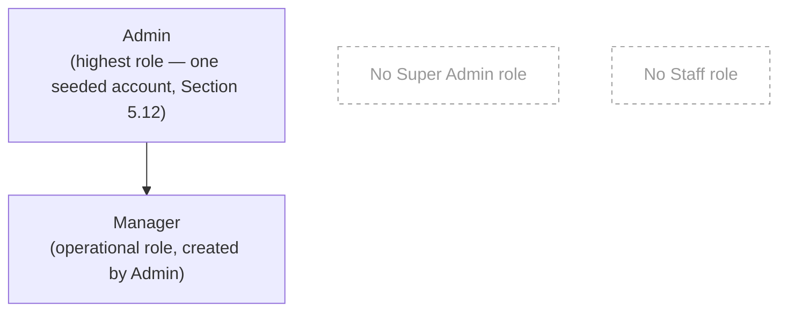
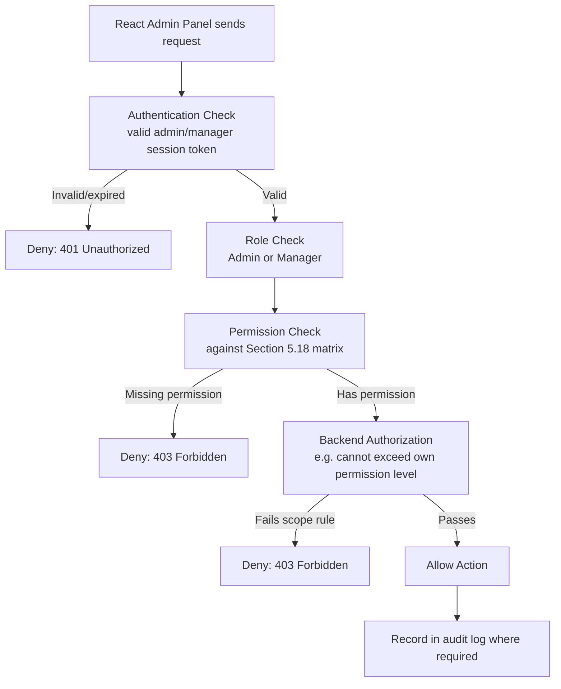

# Requirements — RBAC (Roles and Permissions)

> Part of the requirements set — see [01-overview.md](01-overview.md) for the index. Admin operational modules (Sections 5.1–5.9) live in [05-admin-operations.md](05-admin-operations.md); the order state machine (Section 5.21) lives in [07-order-state-machine.md](07-order-state-machine.md).

### 5.10 Role Management

The system will use **Role-Based Access Control (RBAC)** to control administrative access.

The role hierarchy is:

```text
Admin
     ↓
Manager
```

The administrative roles are:

- **Admin**
- **Manager**

There is no "Super Admin" role and no "Staff" role. Admin is the highest-level administrative role; Manager is the operational role below it.

**Diagram:** Administrative role hierarchy.



Each role has a defined maximum permission level.

Manager cannot create, modify, delete, or assign permissions to Admin, and cannot manage another Manager account.

The system will maintain separate permissions for:

- Product and catalogue management
- Order management
- Payment management
- Customer management
- Shipment management
- CMS management
- Analytics and reporting
- Manager account management
- Role management
- Permission management
- System configuration
- RBAC configuration

---

### 5.11 Role Hierarchy

The administrative role hierarchy is:

```text
Admin
     ↓
Manager
```

The hierarchy determines the maximum administrative scope available to each role.

Manager must not:

- Manage the Admin role or any Admin account
- Create an Admin account
- Delete an Admin account
- Modify an Admin account's permissions
- Manage another Manager account (create, update, deactivate, or delete)
- Modify permissions above its own maximum permission level
- Modify system-wide RBAC configuration unless explicitly authorized
- Modify their own role or their own permissions

Operational permissions may be assigned independently within the limits of the user's role.

---

### 5.12 Admin

The **Admin** is the highest-level administrative role and can manage the complete administrative and operational system.

The Admin can:

- Manage products and catalogue
- Manage categories
- Manage product variants
- Manage inventory
- Manage orders
- Verify and reject bKash payments
- Review payment resubmissions
- Confirm COD orders
- Manage customers
- Manage CMS content
- Manage courier configuration
- Create and manage shipments
- View analytics and reports
- View audit logs
- Create Manager accounts
- Update Manager accounts
- Deactivate Manager accounts
- Delete Manager accounts
- Assign and revoke Manager permissions
- Manage Manager operational access

The Admin cannot:

- Create another Admin account through the normal back-office UI
- Grant a Manager a permission that the Admin does not itself possess
- Modify system-wide RBAC rules beyond what is explicitly permitted

There is no "Super Admin" role above Admin. Admin is the top of the hierarchy.

#### 5.12.1 Initial Admin Account (Database Seed)

There is only one Admin account created through the initial database seed process, at first deployment. This is the only way an Admin account is created — there is no back-office UI workflow for creating an Admin account (see Section 5.12.3 and Section 2.7).

The seed process must:

1. Read the initial Admin user identifier from an environment variable (e.g. `SEED_ADMIN_USER_ID`, matching the naming convention already used for local bootstrap secrets).
2. Read the initial Admin password from an environment variable (e.g. `SEED_ADMIN_PASSWORD`).
3. Validate that both values are present before proceeding; fail the seed run with a clear error if either is missing.
4. Securely hash the password using the project's standard password-hashing mechanism (Section 2.1) before storing it.
5. Create the initial user with role `ADMIN`.
6. Never store the plaintext password in the database.
7. Never log the plaintext password, in application logs, console output, or error messages.
8. Never expose the password to the frontend.
9. Never commit the seed credentials to Git, in the PRD, source code, SQL files, or any other tracked file.

Do not hard-code Admin credentials anywhere in the PRD, source code, SQL files, frontend code, backend source files, Git-tracked configuration, or documentation. Bootstrap credentials, where needed for local reference, are kept out-of-band in a gitignored location only (see Section 2.7).

#### 5.12.2 Idempotent Seed

The database seed must be safe to run multiple times and must not create a duplicate initial Admin account.

```text
Run seed
   ↓
Check initial Admin
   ↓
Already exists?
   ├── Yes → Do not create duplicate
   │
   └── No  → Create Admin
```

The implementation must use the database's unique constraints and/or an appropriate lookup/upsert strategy (e.g. a lookup by the seed user identifier, or an `INSERT ... ON CONFLICT DO NOTHING` upsert) to guarantee this. The seed must not create a new Admin every time migrations or deployment scripts run.

#### 5.12.3 Admin Account Protection

Because there is no Super Admin role, the seeded Admin is the highest-level administrative account and must be protected from actions that could permanently remove administrative access from the system.

The seeded Admin account must carry a system-level designation (e.g. an `is_system_admin` flag on the account record) that marks it as protected. This is a property of the specific seeded account, not a separate role — additional Admin accounts, if ever introduced through a future, explicitly separate mechanism, would not automatically carry this designation unless deliberately assigned.

The system must prevent:

- A Manager deleting the system Admin account
- A Manager modifying the system Admin account's role
- A Manager disabling the system Admin account
- A Manager changing the system Admin account's permissions
- The Admin (or any future account with Admin-management access) accidentally deleting the only system Admin account through the normal account-management UI

The normal back-office account-management workflow exposes **Manager creation only** — there is no UI path to create an Admin account. If additional Admin accounts are ever required, that must be defined as a separate, explicitly authorized mechanism outside the scope of this document; it must not be achieved by introducing a "Super Admin" role.

---

### 5.13 Manager

The **Manager** is the operational role below Admin, primarily responsible for day-to-day business and operational activities according to permissions assigned by the Admin.

Managers may be allowed to:

- View dashboard
- Manage products
- Manage catalogue information
- Manage inventory
- View and manage orders
- Verify bKash payments
- Reject bKash payments
- Review payment resubmissions
- Confirm COD orders
- Cancel orders according to assigned permissions
- Manage customers required for order processing
- Create courier shipments
- Select couriers
- Track shipments
- Perform customer risk checks
- View relevant analytics
- Manage CMS content, where assigned that permission (see the permission matrix in 5.18)
- Perform other operational functions assigned to the Manager role

Managers must NOT be able to:

- Create Admin accounts
- Delete Admin accounts
- Create Manager accounts
- Delete other Manager accounts
- Modify Admin permissions
- Modify their own role
- Modify their own permissions
- Manage RBAC configuration
- Manage roles
- Grant themselves additional permissions
- Grant permissions they do not possess
- Modify system configuration unless explicitly permitted

Manager permissions are intended primarily for **business operations**, not administrative user management.

---

### 5.14 Permission Hierarchy Rules

The following rules apply to all administrative accounts.

#### Rule 1 — Role Hierarchy

```text
Admin
     ↓
Manager
```

Manager cannot manage the Admin role, an Admin account, or another Manager account.

#### Rule 2 — User Management

| Action                    | Admin | Manager |
| ------------------------- | ----: | ------: |
| Manage Admin account      |    No |      No |
| Create Manager            |   Yes |      No |
| Update Manager            |   Yes |      No |
| Delete Manager            |   Yes |      No |
| Deactivate Manager        |   Yes |      No |

The system Admin account is protected from deletion or modification by Manager (see Section 5.12.3).

---

### 5.15 Permission Assignment Rules

Permissions will be assigned through the RBAC system.

The following rules must apply:

1. Admin can manage Manager permissions.
2. Manager cannot manage roles or system-wide permissions.
3. Manager cannot modify Admin permissions.
4. Manager cannot assign themselves additional permissions.
5. Manager cannot assign permissions to another Manager account.
6. Admin cannot grant a Manager a permission that the Admin does not itself possess. This must be enforced by the backend at the moment of grant, not only checked when the permission is later used.
7. A user cannot assign a role above their allowed management scope. This applies both when creating a new account and when changing an existing account's role: a user's role can only ever be set (at creation or later) by an actor whose own role and permissions would allow them to create an account of that target role in the first place (per the matrix in Section 5.14/5.18). There is no separate "change role" action that bypasses this scope check.
8. Protected system permissions cannot be modified by Manager.
9. Every permission-changing action must be authorized by the backend.
10. Every permission-changing action must be recorded in the audit log.

Example:

```text
Admin
     ↓
Can manage Manager accounts and permissions

Manager
     ↓
Can perform assigned operational tasks
```

Frontend restrictions such as hiding buttons are not sufficient for authorization.

Every protected administrative API endpoint must perform a backend authorization check.

The authorization flow is:

```text
React Admin Panel
        ↓
Authentication Check
        ↓
Role Check
        ↓
Permission Check
        ↓
Backend Authorization
        ↓
Allow / Deny Action
```

**Diagram:** Backend authorization flow for a protected admin action.



---

### 5.16 Administrative Action Rules

Important administrative actions require appropriate permissions. Each administrative action maps to exactly one permission key, and each permission key maps to exactly one row in the Section 5.18 permission matrix. This mapping is authoritative — the permission keys below are the enum values the backend must implement; the 5.18 matrix row names are the human-readable labels for the same permissions. Implementation must not invent additional permission keys or matrix rows beyond this table without updating both.

| Administrative Action                  | Permission Key            | 5.18 Matrix Row               |
| --------------------------------------- | -------------------------- | ------------------------------ |
| Payment Verification                    | `payment.verify`           | bKash Payment Verification     |
| Payment Rejection                       | `payment.reject`           | bKash Payment Rejection        |
| Payment Resubmission Review             | `payment.review`           | Payment Resubmission Review    |
| Order Confirmation                      | `order.confirm`            | Order Confirmation             |
| Order Cancellation                      | `order.cancel`             | Order Cancellation             |
| Shipment Creation                       | `shipment.create`          | Shipment Creation              |
| Courier Account/API Configuration       | `courier.manage`           | Courier Configuration          |
| Courier Selection (per-order, at ship time) | `courier.select`       | Courier Selection              |
| Manager Creation                        | `user.manager.create`      | Manager Create                 |
| Manager Update                          | `user.manager.update`      | Manager Update                 |
| Manager Deletion                        | `user.manager.delete`      | Manager Delete                 |
| Role Management                         | `role.manage`              | Role Management                |
| Grant/Revoke an "Assigned" Permission   | `permission.assign`        | Manager Permission Assignment  |

**Resolving the `courier.manage` vs. Courier Selection ambiguity:** these are two distinct permissions, not one. `courier.manage` (matrix row **Courier Configuration**, `Assigned` for Manager) governs setting up courier provider accounts, API keys, and integration-level settings — an infrequent, higher-risk configuration action. `courier.select` (matrix row **Courier Selection**, `Yes` for Manager) governs the routine per-order act of picking Pathao or Steadfast when creating a shipment (Section 4.10) — this is a normal operational action every Manager can perform without being separately assigned it. Implementation must treat these as two separate permission checks; a Manager granted only default permissions can select a courier per order but cannot reconfigure courier provider settings unless `courier.manage` is explicitly assigned.

The `permission.assign` permission specifically gates the act of granting or revoking any `Assigned`-tier permission (section 5.18) on a Manager account. This is the enforcement point for section 5.15 rule 6 (an assigner can only grant permissions they themselves currently hold) and rule 4 (a user cannot grant additional permissions to themselves) — the backend must check `permission.assign` on the assigner, and separately verify the specific permission being granted is one the assigner currently holds, before the grant/revoke request is executed.

The backend must verify the required permission before executing the requested action.

If the user does not have the required permission, the API must reject the request.

Example:

```text
Manager attempts to delete Manager
                ↓
Backend checks permission
                ↓
Permission denied
                ↓
Action rejected
```

---

### 5.17 Separation of Operational and Administrative Access

The system will separate **operational permissions** from **administrative permissions**.

Operational permissions include:

- Product management
- Order management
- Payment verification
- COD confirmation
- Customer management
- Shipment creation
- Shipment tracking

Administrative permissions include:

- Manager account management
- Role management
- Permission management
- System configuration
- RBAC configuration

Managers may receive extensive operational permissions without receiving administrative user-management permissions.

This allows Managers to perform day-to-day business operations without being able to modify the administrative structure of the platform.

---

### 5.18 Complete Permission Matrix

The following permission matrix defines the default maximum access scope.

| Permission Area             | Admin |  Manager |
| ---------------------------- | ----: | -------: |
| Dashboard View               |   Yes |      Yes |
| Analytics View               |   Yes | Assigned |
| Audit Log View                |   Yes | Assigned |
| Product Create                |   Yes |      Yes |
| Product Update                |   Yes |      Yes |
| Product Delete                |   Yes | Assigned |
| Category Management          |   Yes |      Yes |
| Product Image Management     |   Yes |      Yes |
| Size / Colour Management     |   Yes |      Yes |
| Variant Management            |   Yes |      Yes |
| Price Management              |   Yes |      Yes |
| Inventory Management          |   Yes |      Yes |
| Product Visibility            |   Yes |      Yes |
| Order View                    |   Yes |      Yes |
| Order Update                  |   Yes | Assigned |
| Order Confirmation            |   Yes |      Yes |
| Order Cancellation            |   Yes | Assigned |
| bKash Payment View            |   Yes |      Yes |
| bKash Payment Verification    |   Yes |      Yes |
| bKash Payment Rejection       |   Yes |      Yes |
| Payment Resubmission Review   |   Yes |      Yes |
| COD Order Confirmation        |   Yes |      Yes |
| Customer View                 |   Yes |      Yes |
| Customer Update               |   Yes | Assigned |
| Customer Risk Check           |   Yes |      Yes |
| Shipment View                 |   Yes |      Yes |
| Shipment Creation             |   Yes |      Yes |
| Courier Selection              |   Yes |      Yes |
| Shipment Tracking              |   Yes |      Yes |
| Shipment Retry                 |   Yes |      Yes |
| Change Courier                 |   Yes |      Yes |
| Courier Configuration          |   Yes | Assigned |
| CMS Management                 |   Yes | Assigned |
| Manager Create                 |   Yes |       No |
| Manager Update                 |   Yes |       No |
| Manager Delete                 |   Yes |       No |
| Manager Permission Assignment  |   Yes |       No |
| Role Management                |   Yes |       No |
| Permission Management          |   Yes |       No |
| System Configuration           |   Yes |       No |
| RBAC Configuration              |   Yes |       No |
| Coupon View                    |   Yes |      Yes |
| Coupon Create                  |   Yes | Assigned |
| Coupon Update                  |   Yes | Assigned |
| Coupon Activate/Deactivate     |   Yes | Assigned |
| Coupon Delete/Archive          |   Yes | Assigned |
| Coupon Usage View              |   Yes |      Yes |

**This table is the single authoritative source for the coupon permission Admin/Manager values above** (Section 5.16's mapping rule). The permission-key mapping (e.g. `coupon.view`, `coupon.create`) and the rationale for the `Assigned`-for-Manager defaults — which follow the same pattern already used for CMS Management — are documented in Section 8.19 ([10-coupon-discount.md](10-coupon-discount.md)), which references this table rather than restating its values.

`Assigned` means the permission may be granted only when permitted by the user's role and by the RBAC rules.

The backend must enforce this matrix for every protected API endpoint.

---

### 5.19 Administrative Role Data Model

The user/account role field must use a fixed, constrained set of values equivalent to:

```text
ADMIN
MANAGER
CUSTOMER
```

`SUPER_ADMIN` and `STAFF` are not valid administrative roles and must not exist as values the system can assign. Use a database-level constraint or enum type so an invalid role value cannot be inserted, whether by application error or direct database access.

If customer accounts are stored in the same underlying table as administrative accounts, the customer authentication domain (Section 2.4) must remain clearly distinguished from the back-office administrative roles — a customer role value must never grant access to any Admin/Manager back-office function, and vice versa.

The `CUSTOMER` role value applies only to customer records that have login credentials (registered customers, Section 2.1). A guest customer reference (Section 2.9.4) has no password/authentication identity and therefore does not participate in RBAC at all — it is not assigned the `CUSTOMER` role or any other role, since it cannot authenticate or hold a session. Guest checkout, guest order lookup (Section 2.9), and the public Track Order feature (Section 4.14) are accordingly unauthenticated flows, gated by request-level validation (submitted fields at checkout; Order Number + Phone Number for order lookup; courier Order ID / Tracking ID for Track Order) rather than by RBAC/session checks. This applies equally when a registered customer uses Track Order or the guest order lookup without being logged in — those endpoints do not check for or require a session. This does not change the role enum itself or introduce a new role.

---
