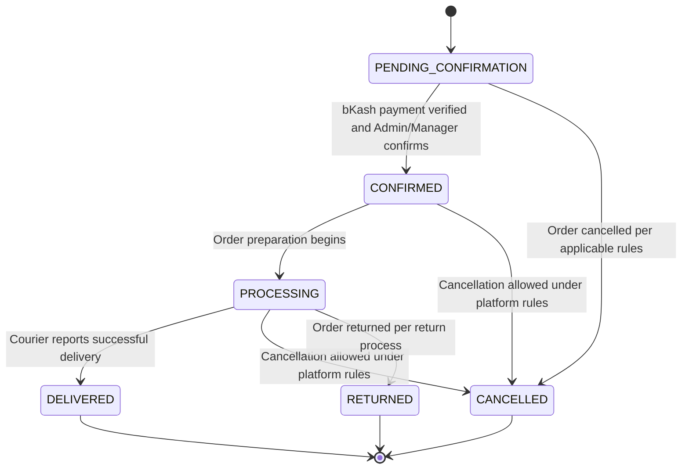
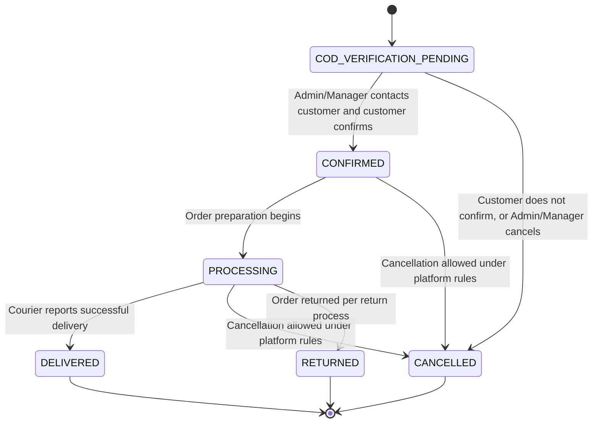
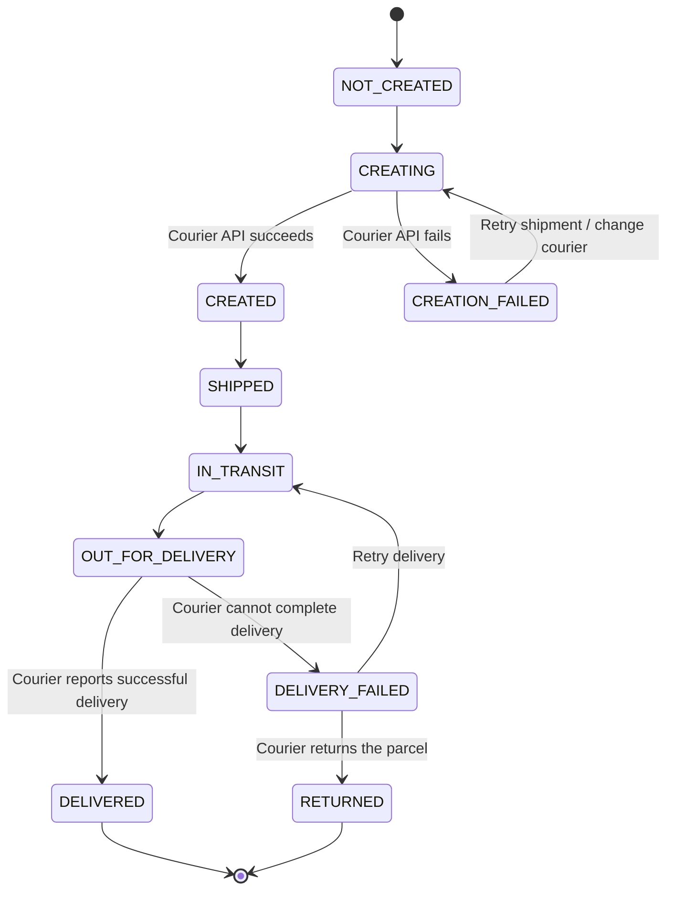
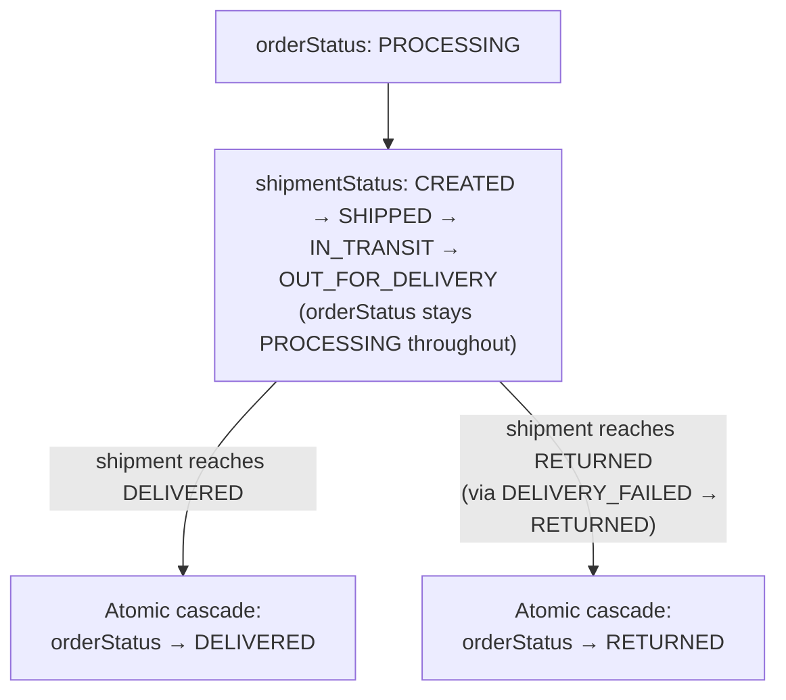

# Requirements — Order/Payment/Shipment State Machine (Authoritative)

> Part of the requirements set — see [01-overview.md](01-overview.md) for the index. This section is the single source of truth for the order-status, payment-status, and shipment-status enums and transitions; Sections 2–4 (see [02-customer.md](02-customer.md), [03-payment-order.md](03-payment-order.md), [04-courier-shipment.md](04-courier-shipment.md)) use UI display labels and narrative diagrams only.

### 5.21 Exact Order Status Transitions

The system will enforce a strict order-status transition system.

An order can only move to the next status through an allowed transition.

Payment status and shipment status are maintained separately and must not be treated as replacements for the order status.

This state machine applies identically to orders placed by registered customers and to guest orders (Section 2.9) — an order's statuses, transitions, and authorization rules do not depend on whether the underlying customer record is a registered account or a guest customer reference (Section 2.9.4).

The main order statuses are:

```text
PENDING_CONFIRMATION
COD_VERIFICATION_PENDING
CONFIRMED
PROCESSING
DELIVERED
CANCELLED
RETURNED
```

For bKash orders, the initial status is:

```text
PENDING_CONFIRMATION
```

For COD orders, the initial status is:

```text
COD_VERIFICATION_PENDING
```

---

### 5.21.1 bKash Order Status Transitions

A bKash order follows this lifecycle:

```text
PENDING_CONFIRMATION
        ↓
CONFIRMED
        ↓
PROCESSING
        ↓
DELIVERED
```

The complete process is:

```text
Customer Places Order
        ↓
PENDING_CONFIRMATION
        ↓
Payment Verified
        ↓
CONFIRMED
        ↓
Order Processing
        ↓
PROCESSING
        ↓
Shipment Successfully Delivered
        ↓
DELIVERED
```

Required transitions:

| Current Status         | Next Status  | Condition / Trigger                                            |
| ---------------------- | ------------ | -------------------------------------------------------------- |
| `PENDING_CONFIRMATION` | `CONFIRMED`  | bKash payment is verified and Admin/Manager confirms the order |
| `CONFIRMED`            | `PROCESSING` | Order preparation begins                                       |
| `PROCESSING`           | `DELIVERED`  | Courier reports successful delivery                            |
| `PENDING_CONFIRMATION` | `CANCELLED`  | Order is cancelled according to applicable rules               |
| `CONFIRMED`            | `CANCELLED`  | Cancellation is allowed under platform rules                   |
| `PROCESSING`           | `CANCELLED`  | Cancellation is allowed under platform rules                   |
| `PROCESSING`           | `RETURNED`   | Order is returned according to the applicable return process   |

**Diagram:** bKash order-status state machine (states and transitions per the table above).



A bKash order cannot move directly from:

```text
PENDING_CONFIRMATION → PROCESSING
```

or:

```text
PENDING_CONFIRMATION → SHIPPED
```

The payment must first be successfully verified and the order must then be confirmed.

---

### 5.21.2 bKash Payment Rejection and Resubmission

Payment rejection does not create a new order status.

The order remains:

```text
Order Status:
PENDING_CONFIRMATION
```

while the payment status changes:

```text
Payment Status:
PENDING_VERIFICATION
        ↓
REJECTED
```

The system must store:

- Rejection reason
- Rejection timestamp
- Rejecting Admin/Manager
- Previous payment submission
- New payment submission when resubmitted

If the customer resubmits payment information:

```text
Payment Status:
REJECTED
        ↓
PENDING_VERIFICATION
```

The customer may submit:

- New Transaction ID
- New payment screenshot
- Updated payment information where required

The previous rejected submission must remain available in the payment history.

If the new payment information is successfully verified:

```text
Payment Status:
PENDING_VERIFICATION
        ↓
PAID / VERIFIED
```

The Admin or Manager can then confirm the order:

```text
Order Status:
PENDING_CONFIRMATION
        ↓
CONFIRMED
```

Complete flow:

```text
Payment Rejected
        ↓
Order remains Pending Confirmation
        ↓
Customer Resubmits Payment
        ↓
Payment Verification
        ↓
Payment Verified
        ↓
Order Confirmed
```

Payment rejection must not automatically cancel the order.

The order may be cancelled separately according to the platform's cancellation rules.

**Diagram:** bKash payment-status state machine (independent of order status, per this section).

```mermaid
stateDiagram-v2
    [*] --> PENDING_VERIFICATION
    PENDING_VERIFICATION --> REJECTED: Admin/Manager rejects submitted payment
    REJECTED --> PENDING_VERIFICATION: Customer resubmits payment info
    PENDING_VERIFICATION --> "PAID / VERIFIED": Admin/Manager verifies payment
    "PAID / VERIFIED" --> [*]
```

---

### 5.21.3 COD Order Status Transitions

A COD order follows this lifecycle:

```text
COD_VERIFICATION_PENDING
        ↓
CONFIRMED
        ↓
PROCESSING
        ↓
DELIVERED
```

Required transitions:

| Current Status             | Next Status  | Condition / Trigger                                             |
| -------------------------- | ------------ | --------------------------------------------------------------- |
| `COD_VERIFICATION_PENDING` | `CONFIRMED`  | Admin/Manager contacts customer and customer confirms the order |
| `COD_VERIFICATION_PENDING` | `CANCELLED`  | Customer does not confirm or Admin/Manager cancels the order    |
| `CONFIRMED`                | `PROCESSING` | Order preparation begins                                        |
| `CONFIRMED`                | `CANCELLED`  | Cancellation is allowed under platform rules                    |
| `PROCESSING`               | `DELIVERED`  | Courier reports successful delivery                             |
| `PROCESSING`               | `CANCELLED`  | Cancellation is allowed under platform rules                    |
| `PROCESSING`               | `RETURNED`   | Order is returned according to the applicable return process    |

**Diagram:** COD order-status state machine (states and transitions per the table above).



A COD order does not require payment verification before it becomes `CONFIRMED`.

The payment remains:

```text
Payment Status:
PENDING_COLLECTION
```

until the courier successfully collects the COD payment.

After successful delivery and collection:

```text
Payment Status:
PAID / COLLECTED
```

**COD collection discrepancy:** It is possible for the courier to report `DELIVERED` while COD collection has not actually been confirmed (e.g. courier marks delivery complete before reconciling cash). In this case, `orderStatus: DELIVERED` and `paymentStatus: PENDING_COLLECTION` may coexist temporarily. This is not an error condition — the Admin/Manager must be able to see this combination flagged in the Order Panel and manually update `paymentStatus` to `PAID / COLLECTED` once collection is confirmed (via courier settlement report or manual follow-up). The system must not auto-assume payment was collected just because delivery succeeded. This flag is a computed UI condition (`orderStatus === DELIVERED AND paymentStatus === PENDING_COLLECTION`), evaluated at display/query time — it is not a stored field on the order.

**Resolution when collection ultimately fails:** If the Admin/Manager determines collection will never happen (e.g. courier confirms the customer never paid and the parcel is not returnable), `orderStatus` remains `DELIVERED` and is not reverted — delivery already occurred and is a fact independent of payment. `paymentStatus` is manually set to `REJECTED` by the Admin/Manager to close out the discrepancy, with the reason, timestamp, and acting user recorded per the status-change audit rules in 5.21.11. `orderStatus: DELIVERED` with `paymentStatus: REJECTED` is therefore a valid, permanent terminal combination representing "delivered, payment not recovered" — it is a business/collections matter handled outside the order state machine (e.g. manual follow-up or write-off), not a system-managed transition.

**Diagram:** COD payment-status state machine, including the delivered-but-uncollected discrepancy and its manual resolution.

```mermaid
stateDiagram-v2
    [*] --> PENDING_COLLECTION
    PENDING_COLLECTION --> "PAID / COLLECTED": Courier successfully collects COD payment
    PENDING_COLLECTION --> REJECTED: Admin/Manager determines collection will never happen (manual)
    "PAID / COLLECTED" --> [*]
    REJECTED --> [*]

    note right of PENDING_COLLECTION
      orderStatus may already be DELIVERED
      while paymentStatus is still
      PENDING_COLLECTION (flagged in Order Panel)
    end note
```

---

### 5.21.4 Shipment Status and Order Status Relationship

Shipment status is maintained separately from order status.

The shipment lifecycle is:

```text
NOT_CREATED
      ↓
CREATING
      ↓
CREATED
      ↓
SHIPPED
      ↓
IN_TRANSIT
      ↓
OUT_FOR_DELIVERY
      ↓
DELIVERED
```

Shipment failure states are handled separately:

```text
CREATING
      ↓
CREATION_FAILED
```

and:

```text
OUT_FOR_DELIVERY
      ↓
DELIVERY_FAILED
```

The order status does not change to:

```text
SHIPPED
IN_TRANSIT
OUT_FOR_DELIVERY
```

because these are shipment states.

The order remains:

```text
PROCESSING
```

while the shipment moves through:

```text
CREATED
    ↓
SHIPPED
    ↓
IN_TRANSIT
    ↓
OUT_FOR_DELIVERY
```

When the courier reports successful delivery:

```text
Shipment Status:
OUT_FOR_DELIVERY
        ↓
DELIVERED

Order Status:
PROCESSING
        ↓
DELIVERED
```

This keeps the order lifecycle and courier lifecycle separate.

**Diagram:** Shipment-status state machine, independent of order status (combines the base lifecycle from this section with the failure/retry paths from 5.21.5–5.21.6).



---

### 5.21.5 Shipment Creation Failure

If courier shipment creation fails:

```text
Shipment Status:
CREATING
        ↓
CREATION_FAILED
```

The order remains:

```text
PROCESSING
```

The system must:

- Store the courier API error
- Store the failure timestamp
- Store the courier used
- Display the failure reason to authorized Admin/Manager users
- Allow shipment retry
- Allow changing the courier
- Keep the order active

Retry flow:

```text
CREATION_FAILED
        ↓
Retry Shipment
        ↓
CREATING
        ↓
CREATED
```

Change-courier flow:

```text
CREATION_FAILED
        ↓
Change Courier
        ↓
CREATING
        ↓
CREATED
```

The order must not be marked as delivered or completed because of a shipment-creation failure.

A shipment creation failure must not automatically change:

```text
Payment Status:
PAID / VERIFIED
```

to:

```text
Payment Status:
REJECTED
```

for a bKash order.

A courier API failure must also not automatically cancel a confirmed order.

---

### 5.21.6 Delivery Failure

If the courier cannot complete delivery:

```text
Shipment Status:
OUT_FOR_DELIVERY
        ↓
DELIVERY_FAILED
```

The order remains:

```text
PROCESSING
```

until the final outcome is known.

The Admin or Manager can handle the failed delivery according to the courier outcome.

#### Retry Delivery

```text
DELIVERY_FAILED
        ↓
Retry Delivery
        ↓
IN_TRANSIT
        ↓
OUT_FOR_DELIVERY
        ↓
DELIVERED
```

The order remains:

```text
PROCESSING
```

until successful delivery.

#### Returned to Store

If the courier returns the parcel:

```text
DELIVERY_FAILED
        ↓
RETURNED
```

The corresponding shipment status becomes:

```text
RETURNED
```

and the order status becomes:

```text
RETURNED
```

The shipment-status update and the resulting order-status cascade must be applied together as a single atomic operation (the same single-transaction handling required for stock restoration in Section 5.1), so the system can never be left with the shipment already `RETURNED` while the order still shows `PROCESSING`. The same atomicity requirement applies to the `DELIVERED` cascade in Section 5.21.4.

The system should store the courier return reason and relevant tracking history.

**Diagram:** How the three independent status fields interact while an order is `PROCESSING` — the shipment status moves through its own lifecycle underneath, and only two shipment outcomes cascade into an order-status change, applied atomically (5.21.4, 5.21.6).



---

### 5.21.7 Cancellation Transitions

Cancellation must only occur from statuses where cancellation is permitted.

Allowed cancellation transitions include:

```text
PENDING_CONFIRMATION
        ↓
CANCELLED
```

For COD:

```text
COD_VERIFICATION_PENDING
        ↓
CANCELLED
```

Where business rules allow cancellation after confirmation:

```text
CONFIRMED
        ↓
CANCELLED
```

Where business rules allow cancellation during processing:

```text
PROCESSING
        ↓
CANCELLED
```

`PROCESSING → RETURNED` is a separate transition from the manual cancellation covered in this section — it is primarily system-triggered automatically when the linked shipment reaches a `Returned` status, with Admin/Manager able to trigger it manually as a fallback. See 5.21.6 (atomicity of status cascades) and 5.21.9 for that transition's authoritative rule.

The system should not allow normal cancellation after successful delivery:

```text
DELIVERED → CANCELLED
```

**Post-delivery returns (v1 scope):** There is no `DELIVERED → RETURNED` state transition in v1. Post-delivery returns are handled manually by Admin/Manager outside the order state machine (direct customer contact, manual refund/exchange arrangement). A formal in-system return/RMA workflow, including a `DELIVERED → RETURNED` transition, may be added in a future version.

If a shipment has already been created with the courier (Shipment Status is `Created` or later, per section 4.12) at the time an order is cancelled, the courier's `Cancel Shipment` operation (section 4.9) must be called so the courier-side shipment is also cancelled, not just the internal order status. If the courier cannot cancel the shipment (e.g. it is already out for delivery), the order cancellation must be blocked or escalated to Admin/Manager rather than silently leaving the shipment active.

Every cancellation should record:

- Cancellation reason
- Cancellation timestamp
- User who cancelled the order
- Previous order status
- Current order status

---

### 5.21.8 Complete Transition Rules

The backend will enforce the following order transitions.

#### bKash

```text
PENDING_CONFIRMATION
        │
        ├──────────────→ CANCELLED
        │
        ↓
   CONFIRMED
        │
        ├──────────────→ CANCELLED
        │
        ↓
   PROCESSING
        │
        ├──────────────→ CANCELLED
        │
        └──────────────→ RETURNED
        │
        ↓
    DELIVERED
```

#### COD

```text
COD_VERIFICATION_PENDING
        │
        ├──────────────→ CANCELLED
        │
        ↓
   CONFIRMED
        │
        ├──────────────→ CANCELLED
        │
        ↓
   PROCESSING
        │
        ├──────────────→ CANCELLED
        │
        └──────────────→ RETURNED
        │
        ↓
    DELIVERED
```

#### Shipment

Shipment status is handled independently:

```text
NOT_CREATED
      ↓
CREATING
      ├──────────────→ CREATION_FAILED
      │                      ↓
      │               Retry / Change Courier
      │                      ↓
      └────────────────── CREATING
                             ↓
                          CREATED
                             ↓
                          SHIPPED
                             ↓
                         IN_TRANSIT
                             ↓
                       OUT_FOR_DELIVERY
                         ↙           ↘
                    DELIVERED    DELIVERY_FAILED
                                      ↓
                              Retry / Returned
                                 ↙        ↘
                          IN_TRANSIT     RETURNED
```

---

### 5.21.9 Transition Authorization

Order-status transitions must also follow RBAC permissions.

| Transition                                    | Allowed Actor / Trigger                                   |
| --------------------------------------------- | --------------------------------------------------------- |
| `PENDING_CONFIRMATION → CONFIRMED`            | Admin / Manager after bKash payment verification          |
| `COD_VERIFICATION_PENDING → CONFIRMED`        | Admin / Manager after customer confirmation               |
| `PENDING_CONFIRMATION → CANCELLED`            | Admin / Manager with cancellation permission              |
| `COD_VERIFICATION_PENDING → CANCELLED`        | Admin / Manager with cancellation permission              |
| `CONFIRMED → PROCESSING`                      | Admin / Manager                                            |
| `CONFIRMED → CANCELLED`                       | Authorized Admin / Manager                                |
| `PROCESSING → CANCELLED`                      | Admin / Manager with cancellation permission              |
| `PROCESSING → RETURNED`                       | System, automatically when the linked shipment reaches `RETURNED` (see Shipment `DELIVERY_FAILED → RETURNED` below); Admin/Manager may also trigger it manually for a documented return outcome not reflected by courier sync |
| `PROCESSING → DELIVERED`                      | System based on successful courier delivery               |
| Shipment `NOT_CREATED → CREATING`             | Admin / Manager                                            |
| Shipment `CREATING → CREATED`                 | System after successful courier API response              |
| Shipment `CREATING → CREATION_FAILED`         | System after failed courier API response                  |
| Shipment `CREATED → SHIPPED`                  | Admin / Manager after parcel handover                      |
| Shipment `SHIPPED → IN_TRANSIT`               | System / courier status synchronization                   |
| Shipment `IN_TRANSIT → OUT_FOR_DELIVERY`      | System / courier status synchronization                   |
| Shipment `OUT_FOR_DELIVERY → DELIVERED`       | System / courier status synchronization                   |
| Shipment `OUT_FOR_DELIVERY → DELIVERY_FAILED` | System / courier status synchronization                   |
| Shipment `DELIVERY_FAILED → IN_TRANSIT`       | Admin / Manager retry or courier update                   |
| Shipment `DELIVERY_FAILED → RETURNED`         | System / courier status synchronization                   |

---

### 5.21.10 Invalid Transitions

The backend must reject invalid status transitions.

Examples:

```text
PENDING_CONFIRMATION → DELIVERED       ❌
PENDING_CONFIRMATION → PROCESSING      ❌
PENDING_CONFIRMATION → SHIPPED         ❌
COD_VERIFICATION_PENDING → SHIPPED     ❌
CONFIRMED → DELIVERED                  ❌
PROCESSING → OUT_FOR_DELIVERY          ❌
DELIVERED → CANCELLED                  ❌
```

Valid examples:

```text
PENDING_CONFIRMATION → CONFIRMED       ✓
CONFIRMED → PROCESSING                 ✓
PROCESSING → DELIVERED                 ✓
COD_VERIFICATION_PENDING → CONFIRMED   ✓
PROCESSING → RETURNED                  ✓
```

The backend must validate every status-changing request before updating the database.

A frontend user must not be able to bypass these rules by directly sending an API request.

The backend should return an appropriate authorization or transition-validation error when an invalid request is received.

---

### 5.21.11 Final Status Model

For implementation, the system will maintain three independent status fields:

```text
Order
├── paymentStatus
├── orderStatus
└── shipmentStatus
```

These three fields represent different parts of the order lifecycle.

#### Example — bKash Order

```text
paymentStatus:  PAID / VERIFIED
orderStatus:    PROCESSING
shipmentStatus: IN_TRANSIT
```

This means:

- Payment has been successfully verified.
- The order is being processed.
- The shipment is currently in transit.

#### Example — COD Order

```text
paymentStatus:  PENDING_COLLECTION
orderStatus:    PROCESSING
shipmentStatus: OUT_FOR_DELIVERY
```

This means:

- Payment has not yet been collected.
- The order is being processed.
- The parcel is currently out for delivery.

#### Example — Delivered bKash Order

```text
paymentStatus:  PAID / VERIFIED
orderStatus:    DELIVERED
shipmentStatus: DELIVERED
```

#### Example — Delivered COD Order

```text
paymentStatus:  PAID / COLLECTED
orderStatus:    DELIVERED
shipmentStatus: DELIVERED
```

The backend must maintain these statuses independently and must not overwrite one status field with another.

**Coupon/discount fields do not change this state machine.** An order may additionally carry an applied coupon reference and discount amount (Section 8.23, [10-coupon-discount.md](10-coupon-discount.md)), but these are order attributes alongside the existing subtotal/shipping/total fields — no new order/payment/shipment status value, and no new transition, is introduced by the coupon feature. In particular, coupon usage recording (Section 8.26) happens at order creation, independent of and prior to any status transition defined in this file.

The system must use the status-transition rules defined above for all order, payment, and shipment state changes.

All status changes should be recorded with:

- Previous status
- New status
- Timestamp
- Triggering user or system process
- Reason where applicable
- Related payment, order, or shipment event

This provides a complete and traceable lifecycle for every order.

---
