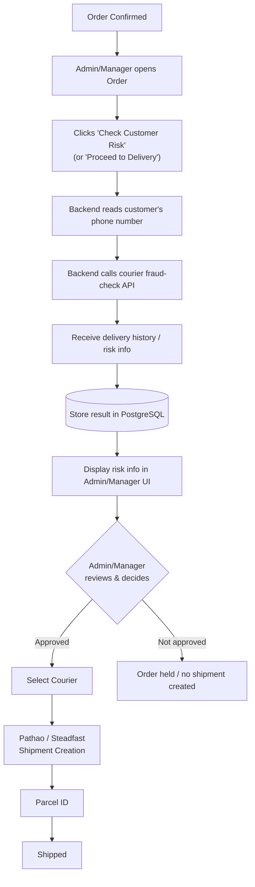
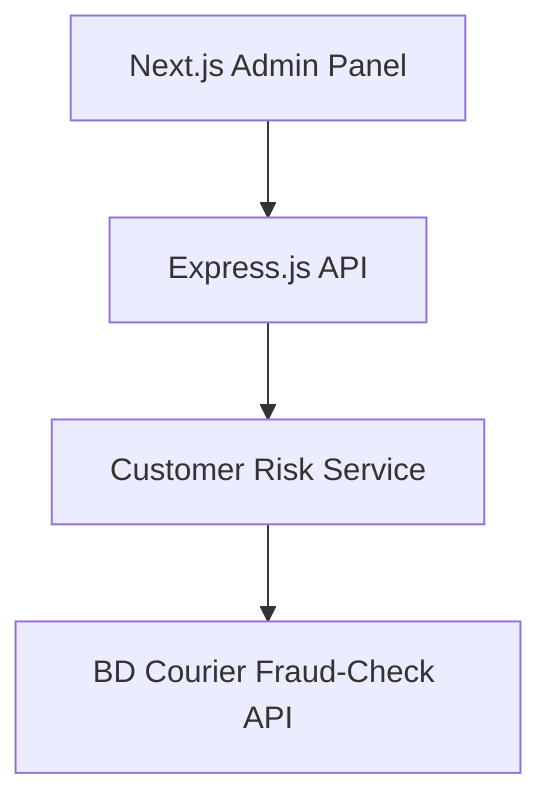
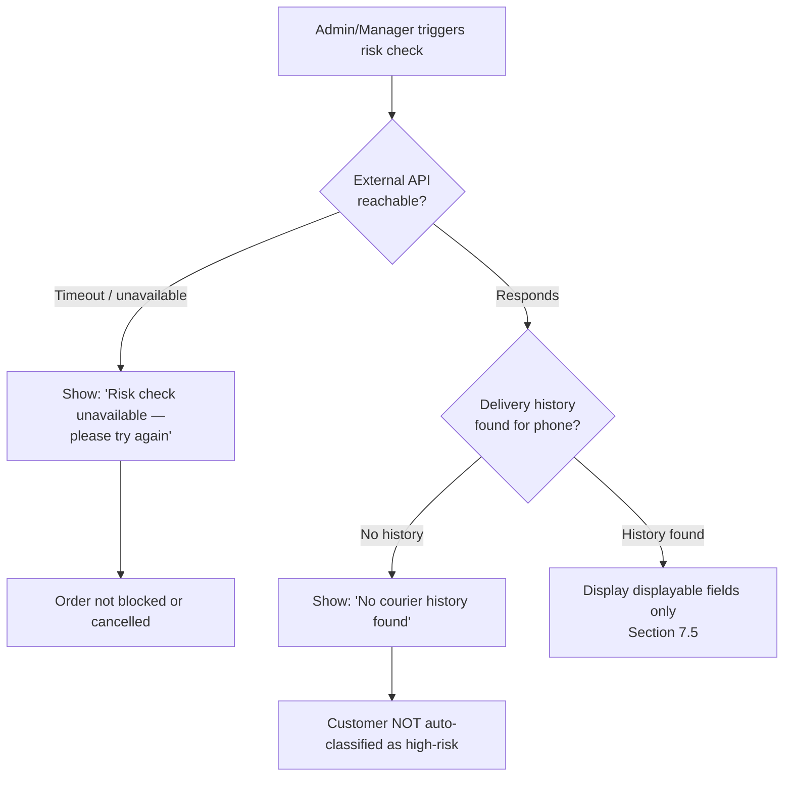
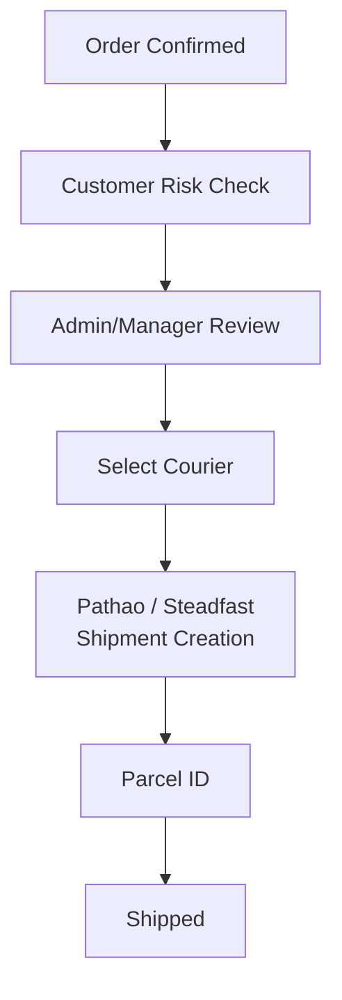

# Requirements — Courier Fraud / Customer Risk Check

> Part of the requirements set — see [01-overview.md](01-overview.md) for the index. Builds on the courier integration in [04-courier-shipment.md](04-courier-shipment.md) and RBAC in [06-rbac.md](06-rbac.md).

## 7. Courier Fraud / Customer Risk Check

### 7.1 Purpose

Before a shipment is created with Pathao or Steadfast, the system checks the customer's delivery history through a courier fraud/risk-check service (e.g. **BD Courier API** — https://bdcourier.com/api-docs#endpoints) and surfaces the result to the Admin/Manager so they can decide whether to proceed. This is a **risk indicator based on courier delivery history**, not proof of fraud, and the system must never label a customer as a criminal or definitively call them a "fraudster."

This feature does not replace or modify the existing Pathao/Steadfast courier integration (Sections 4.8–4.11) — it adds a review step before shipment creation.

### 7.2 Workflow

```text
Order Confirmed
      ↓
Admin/Manager opens Order
      ↓
Clicks "Check Customer Risk" (or "Proceed to Delivery")
      ↓
Backend reads the customer's phone number
      ↓
Backend calls the configured courier fraud-check API
      ↓
Receive customer delivery history / risk information
      ↓
Store the result in PostgreSQL
      ↓
Display risk information in the Admin/Manager order interface
      ↓
Admin/Manager reviews and decides whether to proceed
      ↓
If approved → Select Courier → Pathao / Steadfast Shipment Creation → Parcel ID → Shipped
```

**Diagram:**



The risk check must happen **before** courier shipment creation and must never run automatically without an Admin/Manager-initiated action for a given order (the initial check may be prompted by opening the order, but the external API call itself is triggered explicitly, not on every page load — see 7.6).

The "Check Customer Risk" action is only enabled when the order's `orderStatus` (Section 5.21) is `CONFIRMED` or later in the fulfillment path up to (and including) shipment creation — i.e. `CONFIRMED` or `PROCESSING`. It is disabled/hidden for orders in `PENDING_VERIFICATION`, `PENDING_CONFIRMATION`, `CANCELLED`, `DELIVERED`, or `RETURNED`. The backend must enforce this status check server-side, not only hide the control in the UI — a request to run or store a fresh risk check against an order outside this status range must be rejected.

### 7.3 Backend Architecture

The courier fraud-check API is called **only from the Express.js backend**, never directly from the Next.js frontend, consistent with the existing courier integration architecture (Section 4.8):

```text
Next.js Admin Panel
        ↓
Express.js API
        ↓
Customer Risk Service
        ↓
BD Courier Fraud-Check API
```

**Diagram:**



A dedicated service module handles this integration, kept separate from the existing courier shipment service (Section 4.9):

```text
backend/
  services/
    courier/
      bdCourierService        (existing shipment integration, if applicable)
    fraud/
      customerRiskService     (new: fraud/risk-check integration)
```

If an equivalent services directory structure already exists in the codebase at implementation time, this integration must follow it rather than introduce a parallel structure.

The exact API endpoint, authentication method (e.g. API key header, bearer token), request format, and response schema must be taken from the current official BD Courier API documentation at implementation time — they must not be guessed or assumed from this document.

### 7.4 Credentials and Configuration

- Credentials for the fraud-check provider are stored in environment variables, never hard-coded in source — for example `BD_COURIER_API_KEY` and `BD_COURIER_BASE_URL`, or whatever variable names and authentication scheme the current API documentation actually requires.
- The API key/token must never be exposed to the browser or the Next.js client bundle, consistent with the credential-handling rule already defined for courier and payment integrations (Sections 4.8, 5.5, 6.7).

### 7.5 Customer Risk Information

When available from the API, the system displays information such as:

- Customer phone number
- Total previous orders
- Successful deliveries
- Returned/failed deliveries
- Delivery success rate
- Risk score
- Risk level/status

The exact fields displayed depend on what the actual API response provides — the system must not invent fields the API does not return.

### 7.6 Caching and Storage

The external API is not called every time an order page is opened. The latest risk-check result is stored in PostgreSQL and reused; the Admin/Manager can manually trigger a fresh check when needed, subject to the same per-account/per-source rate-limiting approach already defined for OTP requests (Section 2.5), applied here to limit how often a fresh check can be triggered for the same customer.

**Cache scope:** the cache key is `customer_id` (i.e. the customer's phone number), not `order_id`. When an order page is opened, the system looks up the most recent `customer_risk_checks` row for that customer across all of their orders and displays it if present, rather than requiring a fresh check per order. `order_id` on each row records which order's review triggered that particular check (provenance), and a new row is only inserted when the Admin/Manager explicitly triggers a fresh check — it is not a per-order cache partition.

**Guest-order compatibility:** because the cache key is the phone number rather than a login/account identifier, this already works identically for guest orders (Section 2.9) — a guest customer reference (Section 2.9.4) has a phone number like any other customer record, so risk checks for guest orders are looked up, cached, and displayed exactly as for registered customers. No change to this caching design is required for guest checkout; the only requirement is that `customer_id` continue to resolve to the phone-number-keyed customer record regardless of whether that record is a registered account or a guest reference.

A new table, e.g. `customer_risk_checks`, stores:

```text
id
customer_id
order_id
phone_number
provider
risk_score
risk_level
total_orders
successful_orders
returned_orders
raw_result
checked_at
checked_by
```

`raw_result` stores the provider's raw response for audit purposes but is not returned to the frontend verbatim if it contains data beyond what Section 7.5 defines as displayable (see 7.8). Only the fields needed for display and decision-making are required; do not store unrelated sensitive information. Column names use `snake_case`, consistent with the PostgreSQL/Supabase stack (Section 1.1); if other tables in the schema at implementation time follow a different documented convention, this table must follow that instead.

### 7.7 Admin/Manager UI

The order details page includes a **Customer Risk** section, for example:

```text
Customer Risk

Phone: 01XXXXXXXXX

Total Orders: 25
Delivered: 22
Returned: 3
Success Rate: 88%

Risk Score: 88
Risk Level: LOW

Last Checked: 20 Sep 2026
```

Risk level is shown with a clear visual status indicator, using one of:

```text
LOW RISK
MEDIUM RISK
HIGH RISK
UNKNOWN
CHECK FAILED
```

### 7.8 Error Handling

- If the external API is unavailable or times out: the order is not blocked or cancelled. The UI shows "Risk check unavailable — please try again," and the Admin/Manager can retry.
- If the API returns no delivery history for the phone number: the UI shows "No courier history found." The customer must not be automatically classified as high-risk or fraudulent in this case.
- The external API's raw response is not exposed directly to the frontend if it contains data beyond what Section 7.5 lists as displayable fields.

**Diagram:**



### 7.9 Security

- API credentials live in environment variables only (Section 7.4).
- Never send passwords, OTPs, authentication/session tokens, or customer information unrelated to the risk check to the external API.
- Bangladesh phone numbers are validated and normalized to the format the API expects before the request is sent.
- Only authorized Admin/Manager users (Section 7.10) can trigger or view a risk check — enforced on the backend per the existing RBAC implementation (Section 5), not by the frontend alone.
- Risk-check actions (who ran a check, when, and for which order/customer) are logged/audited, consistent with the audit-logging rules in Section 5.15 rule 10 and 5.21.11.

### 7.10 Permissions

Access to the customer risk check follows the existing role hierarchy (Section 5.11–5.19):

| Role        | Perform Risk Check | View Risk Check |
| ----------- | ------------------: | ---------------: |
| Admin       |                 Yes |               Yes |
| Manager     |                 Yes |               Yes |

This does not introduce a separate authentication or authorization system — it uses the existing RBAC permission matrix (Section 5.18), which includes a `Customer Risk Check` permission row (Yes for both Admin and Manager).

### 7.11 Relationship to Existing Order/Shipment Workflow

The risk check is inserted as a step between order confirmation and courier selection, without changing the existing order/payment/shipment status model (Sections 3, 4.12–4.13, 5.21):

```text
Order Confirmed
      ↓
Customer Risk Check
      ↓
Admin/Manager Review
      ↓
Select Courier
      ↓
Pathao / Steadfast Shipment Creation
      ↓
Parcel ID
      ↓
Shipped
```

**Diagram:**



The risk check itself does not introduce a new order status — it is a review action available once an order's `orderStatus` reaches `CONFIRMED` (through `PROCESSING`, per 7.2), and does not automatically create a shipment. Shipment creation remains an explicit Admin/Manager action per Section 4.10.
