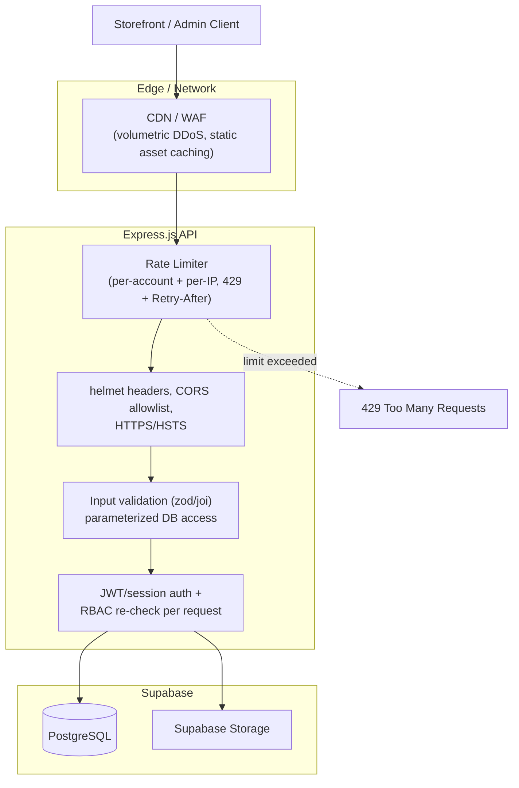

# Requirements — Security Hardening, Rate Limiting & DoS Protection

> Part of the requirements set — see [01-overview.md](01-overview.md) for the index. This file is cross-cutting: it applies to every endpoint in [02-customer.md](02-customer.md), [03-payment-order.md](03-payment-order.md), [04-courier-shipment.md](04-courier-shipment.md), [05-admin-operations.md](05-admin-operations.md), [06-rbac.md](06-rbac.md), [09-fraud-risk-check.md](09-fraud-risk-check.md) and [10-coupon-discount.md](10-coupon-discount.md), rather than introducing a new feature area of its own.

## 11. Security Hardening

### 11.1 Purpose

This file consolidates the security, rate-limiting, and abuse/DoS-prevention rules that must hold across the whole backend, so they are specified once instead of being re-derived per feature. Where an earlier file already defines a rate limit for a specific flow (e.g. OTP in Section 2.5, order lookup in Section 2.16, risk-check triggers in Section 7.6), that file remains authoritative for the numeric thresholds of that flow — this file defines the shared mechanism and the endpoints not otherwise covered.

### 11.2 Rate Limiting — Mechanism

- All rate limiting is enforced **server-side in the Express layer**, never in the Next.js frontend or relied upon as client-side validation only.
- The limiter must be backed by a store that works correctly across multiple backend instances (e.g. Redis via `rate-limiter-flexible` or equivalent), not an in-memory counter, if the deployment target runs more than one backend process/instance. A single-instance in-memory limiter (e.g. `express-rate-limit` default store) is acceptable only if the deployment is confirmed single-instance; this must not silently under-protect a scaled-out deployment.
- Limits are keyed by a combination appropriate to the endpoint — typically **account/customer identifier + source IP** — not IP alone, so a single attacker can't rotate IPs to bypass a per-account limit, and a shared IP (office, NAT, mobile carrier) doesn't lock out unrelated legitimate customers.
- When a limit is exceeded, the API responds with HTTP `429 Too Many Requests` and a `Retry-After` header. The response body must not leak whether the underlying identifier (email, phone, order number) exists — same generic message whether the account exists or not.
- All rate-limit rejections are logged (identifier, IP, endpoint, timestamp) for later review, consistent with the audit-logging approach in Section 5.15 rule 10.

### 11.3 Endpoint Rate-Limit Matrix

| Endpoint / flow | Limit approach | Reference |
| --- | --- | --- |
| Login | Per-account + per-IP, exponential backoff after repeated failures | Section 2.4/2.5 |
| Forgot password / OTP request | Max 3 requests per account per 15-minute window | Section 2.5 |
| OTP verify | Max 5 incorrect attempts per issued OTP | Section 2.5 |
| Guest order lookup (Order Number + Phone) | Capped attempts per order number & per source IP, temporary lockout | Section 2.16 |
| Public Track Order | Separate limiter from guest lookup, own thresholds | Section 4.16 |
| Customer risk-check trigger | Same OTP-style limiting approach, keyed per customer | Section 7.6 |
| Coupon code apply at checkout | Capped attempts per session/customer + per-IP per time window, to block coupon-code brute-forcing/guessing | Section 10.x |
| Registration | Per-IP limit on account-creation requests, to block mass fake-account creation | New — this file |
| Admin/Manager login | Same mechanism as customer login (2.4/2.5); no exemption for back-office accounts | New — this file |
| All other authenticated API routes | A general per-account request-rate ceiling (e.g. default 100 req/min, configurable) as a backstop against compromised-token abuse or runaway client bugs | New — this file |
| All public/unauthenticated API routes | A general per-IP request-rate ceiling (e.g. default 60 req/min, configurable) as a baseline DoS backstop | New — this file |

Thresholds above are configurable business/operational parameters (env-driven), not fixed architecture, consistent with the approach in Section 2.5 — they may be tuned after launch without changing the underlying mechanism.

### 11.4 DoS / DDoS Mitigation

- **Edge/network layer:** production deployment sits behind a CDN/WAF (e.g. Cloudflare) that absorbs volumetric (L3/L4) attacks and caches static assets/images before they reach the origin. This is an infrastructure/deployment requirement, not application code.
- **Request size limits:** the Express JSON/body parser enforces a maximum request body size (e.g. `express.json({ limit: '100kb' })`), with a larger, separately-bounded limit only for the specific upload endpoints that need it (e.g. bKash payment screenshot upload, product image upload), which are additionally restricted by file type and size (Section 5, Storage).
- **Timeouts:** the reverse proxy / hosting layer enforces connection and request timeouts to mitigate slow-request (e.g. Slowloris-style) attacks; the origin does not hold connections open indefinitely.
- **No synchronous heavy work in the request path:** operations such as image processing, report/export generation, or bulk email must not run synchronously inside an HTTP request handler in a way that a burst of requests can exhaust server resources — such work is queued or rate-limited per Section 11.3's general ceilings.
- **Pagination is mandatory** on every list endpoint (products, orders, customers, coupons, etc.) — no endpoint may return an unbounded result set, both for performance and to prevent a single request from being used to exhaust database/memory resources.

### 11.5 Transport & Header Security

- HTTPS is enforced end-to-end in production; HTTP requests are redirected, and HSTS is enabled.
- Security headers are set via `helmet` (or equivalent) on every response: Content-Security-Policy, X-Content-Type-Options, X-Frame-Options (or frame-ancestors via CSP), Referrer-Policy, and HSTS.
- CORS is restricted to the actual deployed frontend origin(s) (storefront + admin back-office domains); wildcard (`*`) CORS is not used on any authenticated endpoint.
- Cookies used for session/auth (if any) are `httpOnly`, `secure`, and `sameSite=strict` or `lax` as appropriate. If auth is bearer-token/JWT-based per Section 5's RBAC design, CSRF exposure is reduced accordingly, but any cookie-based session must still carry CSRF protection.

### 11.6 Input Validation & Injection Prevention

- Every API endpoint validates its input against an explicit schema (e.g. `zod`/`joi`) before touching business logic — reject unknown/malformed fields rather than passing them through.
- All database access goes through parameterized queries / the Supabase client / an ORM query builder — no raw string-concatenated SQL, consistent with the backend access pattern already fixed in Section 1.1.
- File uploads (product images, bKash screenshots) are validated by actual content/MIME type (not just file extension) and re-encoded or scanned before storage where feasible, and stored in Supabase Storage rather than served directly from an executable path.
- Output that renders user-supplied content in the Next.js frontend (e.g. product reviews, customer-entered names) is escaped/sanitized to prevent stored XSS; the backend does not assume the frontend will sanitize it and vice versa — both layers treat user input as untrusted.

### 11.7 Authentication & Session Security

- Passwords are hashed with `bcrypt` or `argon2` (never reversible encryption or a fast general-purpose hash); a minimum password policy is enforced at registration and password-reset time.
- JWTs (or equivalent session tokens) are short-lived; if refresh tokens are used, they are stored server-side (or in an httpOnly cookie) so they can be revoked, and rotated on use.
- Every RBAC-protected route (Section 6) re-checks authorization server-side on each request — the frontend hiding a button or menu item is never treated as sufficient access control, consistent with the enforcement rule already stated in Sections 5.15, 7.9, and elsewhere.
- Admin/Manager accounts are held to the same or stricter password/lockout policy as customer accounts (Section 11.3) — back-office access is a higher-value target, not an exception.

### 11.8 Payment-Specific Security

- The backend never stores or transmits raw card numbers/CVV; payment methods are limited to bKash (manual verification per Section 3) and COD per the existing payment design, and any future card-based gateway integration must use the gateway's own hosted checkout/SDK so PCI scope stays off the platform's servers.
- Order/payment amounts are always recalculated and verified server-side before an order is marked paid or confirmed — the backend never trusts a client-submitted total, consistent with the coupon discount calculation already being server-authoritative (Section 10.x).
- Any payment or courier webhook endpoint verifies the provider's signature before acting on the payload, and is itself rate-limited per Section 11.3's general ceilings to prevent it being used as a DoS vector.

### 11.9 Dependency & Infrastructure Hygiene

- Dependencies are kept current via routine `npm audit` / automated dependency update tooling (e.g. Dependabot); known-vulnerable packages are not shipped to production.
- Environment secrets (API keys, DB credentials, JWT signing secrets) live only in environment variables / the deployment platform's secret store, consistent with the credential-handling rule already fixed in Sections 4.8, 5.5, 6.7, and 7.4 — never committed to source control.
- Centralized logging captures authentication failures, rate-limit rejections (11.2), and 4xx/5xx spikes, with alerting so an in-progress attack (credential stuffing, coupon brute-forcing, scraping) is noticed operationally, not just blocked silently.
- Database backups are taken on a regular schedule and restore is tested at least once before launch.

### 11.10 Non-Goals

This file defines the baseline hardening required for a production Bangladesh-focused clothing e-commerce platform at this scale. It does not mandate enterprise-scale infrastructure (dedicated SOC, custom WAF rules beyond the CDN's defaults, multi-region failover) unless a later requirement explicitly calls for it — no speculative infrastructure beyond what Section 1.1 already scopes.

**Diagram:**

