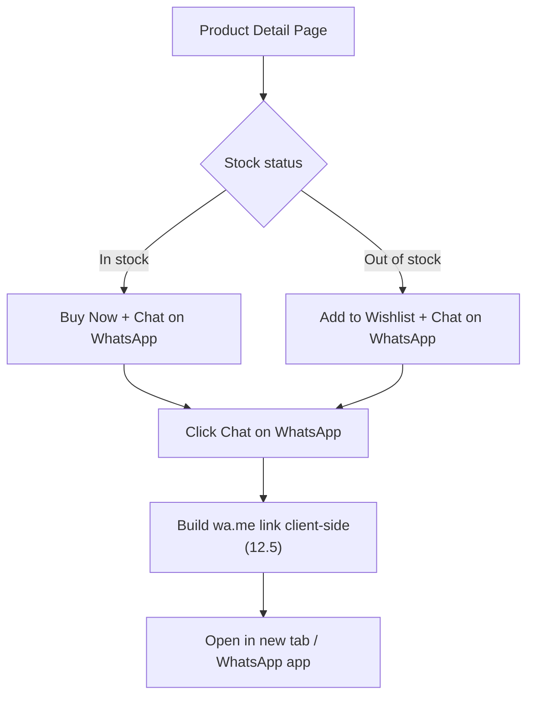

# Requirements — WhatsApp Product Contact (Click-to-Chat)

> Part of the requirements set — see [01-overview.md](01-overview.md) for the index. Applies to the product detail page described in [05-admin-operations.md](05-admin-operations.md) (product/stock management) and follows the credential/config handling rules in [11-security-hardening.md](11-security-hardening.md).

## 12. WhatsApp Product Contact

### 12.1 Purpose

Give customers a direct way to ask about a product's availability via WhatsApp, using a plain **Click-to-Chat (`wa.me`) link** — no Messenger, no Telegram, no WhatsApp Business API/Cloud API integration, and no backend endpoint. This is a frontend-only feature: a correctly constructed link that opens the customer's own WhatsApp (app or web) with a pre-filled message.

### 12.2 Explicitly Out of Scope

- **Messenger integration** — not implemented.
- **Telegram integration** — not implemented.
- **WhatsApp Business API / Cloud API** — not used. No message templates, no webhook, no Meta Business account integration, no backend WhatsApp SDK/client.
- **No new backend API endpoint** for this feature. `wa.me` is a plain URL the browser opens directly; the frontend needs no server round-trip to build it.

### 12.3 Where It Appears

The **Chat on WhatsApp** button appears on the **product detail page**, alongside the primary purchase action:

- **Product in stock:** show **Buy Now** and **Chat on WhatsApp** together.
- **Product out of stock:** show **Add to Wishlist** and **Chat on WhatsApp** together (no Buy Now, consistent with the existing Out of Stock display rule in Section 5).

```text
In stock:      [ Buy Now ]            [ Chat on WhatsApp ]
Out of stock:  [ Add to Wishlist ]    [ Chat on WhatsApp ]
```

**Diagram:**



### 12.4 Configuration

- The destination WhatsApp number is read from a single environment/configuration variable, e.g. `NEXT_PUBLIC_WHATSAPP_NUMBER`, set once and referenced from a shared constant/helper — never hard-coded inline in page or component files.
- Because the number is used to build a client-side link, it is inherently public in the rendered page (same as it would be on a "Call us" link) — this is expected and acceptable; the requirement is *single source of truth*, not secrecy. It must still live in configuration (`.env` / deployment platform env vars), not be duplicated as a literal string across multiple components.
- The number is stored in international format without symbols or leading `+` (the format `wa.me` requires), e.g. `8801XXXXXXXXX` — validated once at startup/build (or via a small shared helper) rather than re-validated ad hoc at each usage site.
- If the environment variable is unset or empty, the **Chat on WhatsApp** button is not rendered (fail closed — no broken link shown to customers), and this condition is logged/flagged in development builds.

### 12.5 Link Construction

The link is built entirely client-side, at click time or render time, from data already available on the product page — no new API call is introduced to build it.

**Format:**

```text
https://wa.me/<NUMBER>?text=<URL-ENCODED MESSAGE>
```

**Message template:**

```text
Hello, I am interested in [Product Name]. Product ID: [ID]. [Variant details]. Is this product available? [Product URL]
```

**Fields included when available:**

| Field | Source | Notes |
| --- | --- | --- |
| Product name | Product data already loaded on the page | Always included |
| Product SKU / product ID | Product data | Included only if the product has one; omitted (not shown as blank/"undefined") if absent |
| Selected size/variant | Current variant selection state on the page | Included only if the product has size/variant options and one is selected; omitted otherwise |
| Selected color/variant | Current variant selection state on the page | Included only if the product has color/variant options and one is selected; omitted otherwise |
| Product URL | `window.location.href` (or the canonical product URL per Section 1.1 SEO rules) at render/click time | Always included |
| Availability question | Fixed short phrase | Always included, e.g. "Is this product available?" |

The message string is assembled from these fields and then passed through `encodeURIComponent` (not manual string replacement) before being appended as the `text` query parameter, so punctuation, spaces, and non-ASCII product names (e.g. Bangla product names) are encoded correctly.

If a field is unavailable (no SKU on this product, no variant selected because the product has none), it is omitted from the message cleanly — the template does not leave literal placeholder text like "Product ID: " with nothing after it, or "undefined"/"null" in the output.

### 12.6 Behavior

- Clicking **Chat on WhatsApp** opens the constructed `https://wa.me/...` URL in a new browser tab (`target="_blank"` with `rel="noopener noreferrer"`), so the customer never loses their place on the product page.
- On a mobile device with the WhatsApp app installed, `wa.me` hands off to the app automatically (standard WhatsApp behavior); on desktop or a device without the app, it opens WhatsApp Web or prompts app installation — this is native `wa.me` behavior and requires no platform-detection code in the frontend.
- The button is a plain anchor/link element pointing at the constructed URL (or a link built on click), not a JavaScript `window.open` popup, so it behaves correctly with browser popup blockers and works identically with JS disabled where feasible.

### 12.7 Implementation Notes

- A single shared helper/component (e.g. `buildWhatsAppLink(product, selectedVariant)` or a `<WhatsAppChatButton />` component) is used everywhere this feature appears, rather than duplicating link-construction logic per page — consistent with the "no speculative infrastructure, but no copy-pasted logic either" approach used elsewhere in this spec.
- No new npm dependency is required — `wa.me` link construction is template-string + `encodeURIComponent`, both native. Do not add a WhatsApp SDK or chat-widget package for this feature.
- Styling follows the existing design system and mobile-first layout rules (Section 1.1); the button sits naturally alongside Buy Now / Add to Wishlist rather than as a floating chat widget, since this spec only covers the product-page contact button, not a site-wide chat widget.

### 12.8 Security & Privacy

- No customer personal data (name, phone, address, order history) is included in the pre-filled message — only product information and a generic availability question, per the message template in Section 12.5. The customer types anything further themselves inside WhatsApp.
- The WhatsApp number is configuration, not a secret (Section 12.4); it still follows the same "single source of truth via env var" discipline as other configuration values per [11-security-hardening.md](11-security-hardening.md) Section 11.9, to avoid a stale/wrong number being hard-coded in multiple places.
- No tracking pixel, analytics event payload, or third-party script is added as part of this feature beyond what the project's existing analytics (Section 6, [08-analytics-meta.md](08-analytics-meta.md)) may already capture as a normal outbound-link click, if that generic mechanism exists; this feature does not introduce a bespoke WhatsApp-specific tracking integration.
