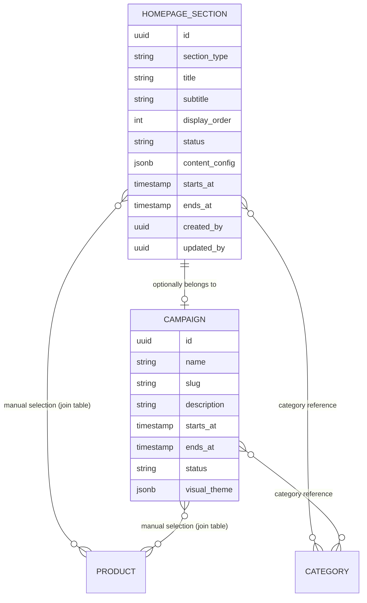
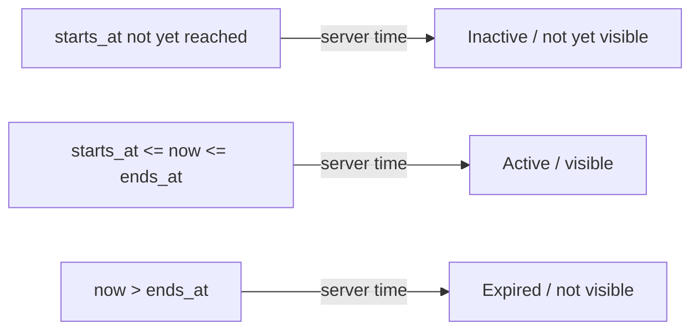
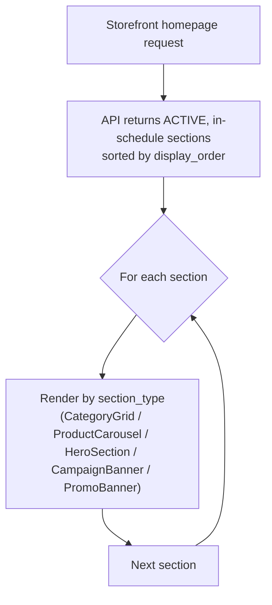

# Requirements — CMS-Driven Homepage & Campaign System

> Part of the requirements set — see [01-overview.md](01-overview.md) for the index. Extends Content Management (Section 5.8, [05-admin-operations.md](05-admin-operations.md)), reuses the catalogue (Section 5.1) and RBAC (Section 06-rbac.md, [06-rbac.md](06-rbac.md)) systems as-is, follows the coupon/discount promotion rules (Section 8, [10-coupon-discount.md](10-coupon-discount.md)) for any offer content, and follows the analytics event rules (Section 6, [08-analytics-meta.md](08-analytics-meta.md)) for homepage interaction tracking.

## 13. CMS-Driven Homepage & Campaign System

### 13.1 Purpose and Scope

The customer storefront homepage is rendered entirely from Admin/Manager-configured content — not hard-coded page sections. Section 5.8 already establishes that the back-office manages homepage banners, promotional sections, featured products, storefront categories, promotional campaigns, homepage sections, and promotional images. This section defines the authoritative data model, section-rendering rules, campaign/scheduling model, and Admin builder UI needed to implement that CMS capability for the homepage specifically.

This feature does **not** introduce:

- A second product or category system (it reuses Section 5.1's catalogue as-is).
- A second discount/offer engine (it reuses Section 8's coupon system as-is — homepage sections only *promote* existing offers).
- A second authentication or permission system (it reuses Section 06-rbac.md's Admin/Manager roles and the existing CMS Management permission).
- A second analytics system (it reuses the events and `event_id` rules in Section 6).

The homepage must support the store's current single category tree (Men, Women, Kids, Footwear, Accessories) and any future category the Admin adds through the existing catalogue (e.g. Electronics) without a frontend code change, because the homepage renders categories and products from data, not from named components per category.

---

### 13.2 Data Model Overview

Two new entities extend the existing catalogue/CMS model: **Homepage Section** and **Campaign**. Both are managed under the existing Content Management module (Section 5.8) and both reference existing catalogue entities (products, categories) rather than duplicating them.



A **Homepage Section** is one renderable block on the homepage (hero, category grid, product carousel, campaign banner, promo banner). A **Campaign** is a named, schedulable theme (Eid, Puja, Winter Collection, a future one-off promotion) that one or more sections can optionally be tagged with; a section with no campaign is a normal, evergreen section.

Existing entities reused unchanged:

- `PRODUCT`, `CATEGORY` — Section 5.1.
- `Featured` product flag, `Active`/`Inactive` status — Section 5.1 (no second product-status field is introduced).
- Coupon/discount data — Section 8 (a "Special Offers" section links to a coupon or category; it does not store its own discount rules).

---

### 13.3 Homepage Section Types

`section_type` is a fixed enum. The frontend renders each type with one reusable component — never a component named after a specific category or campaign (Section 13.9).

| `section_type` | Renders as | Product/Category source |
| --- | --- | --- |
| `HERO` | Large promotional banner with title, subtitle, CTA | None (image + text + link) |
| `CATEGORY_GRID` | Grid of category cards | Selected categories (manual or "all active top-level categories") |
| `PRODUCT_CAROUSEL` | Horizontal/grid product listing | Automatic (Section 13.5) or manual (Section 13.6) |
| `CAMPAIGN_BANNER` | Full-width campaign banner | Linked `campaign_id` |
| `PROMO_BANNER` | Single promotional image/strip (e.g. "Special Offers") | Optional link to a category, collection, or coupon code |
| `CUSTOM_CONTENT` | Free-form rich content block (e.g. "Why Shop With Us") | None |

`content_config` (`jsonb`) holds type-specific fields (e.g. `HERO`'s desktop/mobile image URLs, `PRODUCT_CAROUSEL`'s product-selection rule). Its shape is validated server-side against the schema for that `section_type` on create/update — an invalid shape for the given type is rejected, not silently stored.

---

### 13.4 Common Section Fields

Every Homepage Section has these fields regardless of type, matching the CMS-configurable properties from the project brief:

| Field | Notes |
| --- | --- |
| `section_type` | Fixed enum (Section 13.3), immutable after creation |
| `title` | Optional section heading shown to customers |
| `subtitle` | Optional short promotional text |
| `display_order` | Integer; sections render in ascending order (Section 13.8) |
| `status` | `DRAFT`, `ACTIVE`, `DISABLED` (Section 13.10) |
| `cta_label` / `cta_url` | Optional primary call-to-action |
| `secondary_cta_label` / `secondary_cta_url` | Optional secondary call-to-action (hero only) |
| `desktop_image_url` / `mobile_image_url` | Optional; where a section has imagery, both are configurable independently (Section 13.11) |
| `starts_at` / `ends_at` | Optional section-level scheduling (Section 13.7), independent of any campaign |
| `campaign_id` | Optional FK to `CAMPAIGN` (Section 13.6a) |
| `created_by`, `updated_by`, `created_at`, `updated_at` | Audit fields, same convention as coupons (Section 8.24) |

A section with no `title`/`subtitle`/CTA set simply renders without that element — the frontend does not show empty headings or broken buttons.

---

### 13.5 Automatic Product Selection

`PRODUCT_CAROUSEL` sections configure product selection through `content_config`, using one of two modes.

**Automatic mode** — the section defines a rule, and the product list is computed at render/request time from the existing catalogue:

| Rule | Behavior |
| --- | --- |
| `LATEST` | Most recently created Active products, optionally filtered by category |
| `FEATURED` | Products with the existing `Featured` flag (Section 5.1), Active only |
| `CATEGORY` | Active products in the selected category (and its subcategories) |
| `ON_SALE` | Active products currently discount-eligible per Section 8 |

Automatic mode also configures: `limit` (max product count), optional `category_id` filter, and sort order (`newest`, `manually_selected` — only meaningful in manual mode). Only `Active` products (Section 5.1) are ever eligible for automatic selection; `Inactive` and out-of-stock products are excluded from automatic lists (out-of-stock products may still render with an "Out of Stock" badge if they were manually selected — Section 13.6).

---

### 13.6 Manual Product Selection

**Manual mode** — the Admin explicitly selects an ordered list of products for the section via a join table (`homepage_section_products`: `section_id`, `product_id`, `display_order`). Manual selection can include any product regardless of `Featured` status, but the storefront still respects the product's own `Active`/`Inactive` visibility (Section 5.1) — an `Inactive` product manually added to a section is not rendered until it becomes `Active` again, so the Admin does not need to remember to remove it.

A section uses exactly one mode (`AUTOMATIC` or `MANUAL`), stored as part of `content_config`; switching modes on an existing section replaces its selection behavior but does not delete catalogue data.

#### 13.6a Campaign Product/Category Association

A `CAMPAIGN` may itself reference products and categories (via the same join-table pattern as Section 13.6, scoped to `campaign_id` instead of `section_id`) so that a `CAMPAIGN_BANNER` or a campaign-tagged `PRODUCT_CAROUSEL` can pull "this campaign's products" without the Admin re-selecting them per section.

---

### 13.7 Campaign Data Model and Lifecycle

A **Campaign** is the generic mechanism for festival and promotional themes (Eid, Puja, Pohela Boishakh, Ramadan, Winter Collection, or any future occasion) — there is no festival-specific code path; every campaign, including the first one shipped, is created as ordinary Campaign data.

**Fields:**

| Field | Notes |
| --- | --- |
| `name` | e.g. "Eid Collection" |
| `slug` | URL-safe identifier |
| `description` | Optional |
| `starts_at` / `ends_at` | Date + time, server-evaluated (Section 13.7a) |
| `status` | Stored value is one of `DRAFT`, `ACTIVE`, `DISABLED` (Admin-set); the API additionally returns a computed `SCHEDULED` or `EXPIRED` label when the stored value is `ACTIVE` and the schedule says so (Section 13.7a) |
| `hero_content` | Optional override content for a linked `HERO` section (title, subtitle, images, CTA) |
| `visual_theme` | Optional lightweight presentation data (e.g. accent color, banner treatment) — never arbitrary CSS/script injection (Section 13.13) |
| Linked sections | Any Homepage Section with this `campaign_id` |
| Linked products/categories | Section 13.6a |

#### 13.7a Server-Evaluated Scheduling

Exactly like coupon validity (Section 8.5), campaign and section scheduling is evaluated using **server-side time only** — the customer's browser clock is never trusted. A campaign or section's effective visibility is a computed condition at request time, not a background job that must run to flip a stored value:



`status = DISABLED` always overrides the schedule (an Admin can manually turn off a campaign or section early). `status = DRAFT` is never visible on the storefront regardless of dates (Section 13.10).

For a Campaign, `SCHEDULED` and `EXPIRED` are **both computed the same way** as the "not yet visible" / "expired" branches above — neither is a value the Admin sets directly. Only `DRAFT` and `DISABLED` are stored, Admin-set overrides; `ACTIVE` is the stored default a Campaign is created with. `SCHEDULED` and `EXPIRED` are derived at read time from `starts_at`/`ends_at` whenever the stored value is `ACTIVE`, exactly like a Section: `ACTIVE` + future `starts_at` reads as `SCHEDULED`, `ACTIVE` + `now > ends_at` reads as `EXPIRED`, `ACTIVE` + in-schedule reads as `ACTIVE`/visible. A Section has no distinct `SCHEDULED`/`EXPIRED` *label* in its own `status` field only because Sections aren't shown a computed-status label in the Admin UI the way Campaigns are (Section 13.12); the underlying visibility computation in Section 13.7a is identical for both entities.

---

### 13.8 Homepage Rendering Rule

The frontend never assumes a fixed number or fixed set of sections. Rendering always follows the same rule:



Sections are never rendered by a page template that names specific sections (e.g. "Hero, then Category, then New Arrivals, then Footer" as fixed code) — see the generic component list in Section 13.9. If the Admin adds, removes, disables, or reorders sections, the change is reflected on the next homepage request with no deployment.

An empty `PRODUCT_CAROUSEL` (the selection rule currently returns zero products, e.g. a category with no Active products yet) is omitted from the rendered homepage entirely, rather than shown as an empty block — this is evaluated the same way at request time as the schedule check in Section 13.7a.

---

### 13.9 Reusable Frontend Components

The frontend implements one component per `section_type` (Section 13.3), not one per category, product, or campaign name:

```text
<HeroSection />
<CategoryGrid />
<ProductCarousel />
<CampaignBanner />
<PromoBanner />
<CustomContentBlock />
```

Category and product data flows into `<CategoryGrid />` and `<ProductCarousel />` as props/API data — components such as `<MenCategory />`, `<ElectronicsCategory />`, or `<EidBanner />` must not be created, since that would require a frontend code change every time the Admin adds a category or campaign (violating Section 13.1's scope). A single reusable `<ProductCard />` component (Section 5.1's product fields: image, name, price, discounted price, discount indicator, Featured indicator, out-of-stock state, wishlist action, product link) is shared by `<ProductCarousel />` and every other place products are listed (category pages, search results) — it is not reimplemented per section.

---

### 13.10 Section/Campaign Status Values

Both Homepage Section and Campaign share the same status vocabulary, extended for Campaign's scheduling behavior:

| Status | Meaning | Visible to customers? |
| --- | --- | --- |
| `DRAFT` | Being configured, not ready (stored, Admin-set) | No |
| `ACTIVE` | Stored default; visibility subject to schedule check, Section 13.7a | Yes, if in-schedule |
| `SCHEDULED` | Computed label shown when stored value is `ACTIVE` and `starts_at` is in the future (not a separate stored value; same computation for Campaign and Section) | No |
| `EXPIRED` | Computed label shown when stored value is `ACTIVE` and `now > ends_at` (not a separate stored value; same computation for Campaign and Section) | No |
| `DISABLED` | Manually turned off by Admin/Manager, regardless of schedule (stored, Admin-set) | No |

This distinguishes Draft / Published / Scheduled / Expired / Disabled per the project brief's Admin Preview requirement (Section 13.12) — `SCHEDULED` and `EXPIRED` are presentation labels the API derives at read time, not values the Admin picks from a dropdown.

---

### 13.11 Image Handling

Every section/campaign field that accepts imagery (`desktop_image_url`, `mobile_image_url`, `hero_content` images) is uploaded through the existing Supabase Storage mechanism used for product images (Section 1.1) — no second storage integration. Desktop and mobile images are configured independently so the Admin can supply differently cropped assets per breakpoint; if only one is supplied, the frontend falls back to it for both, rather than failing to render.

---

### 13.12 Admin Homepage Builder

Under the existing Content Management module (Section 5.8), Admin/Manager users with the CMS Management permission (Section 13.14) get a **Homepage Builder** screen:

```text
Homepage Builder

1. Hero Banner            Status: Active     [Edit] [Disable] [Move]
2. Shop by Category       Status: Active     [Edit] [Disable] [Move]
3. New Arrivals           Status: Active     [Edit] [Disable] [Move]
4. Eid Collection         Status: Scheduled  [Edit] [Disable] [Move]
5. Featured Products      Status: Active     [Edit] [Disable] [Move]
6. Special Offers         Status: Disabled   [Edit] [Enable] [Move]

[ + Add Section ]
```

The builder supports: create, edit, disable/enable, archive, and reorder sections (drag-and-drop where it fits the existing admin UI without added complexity — a simple "Move Up/Down" control is an acceptable equivalent). Reordering updates `display_order` for the affected sections in a single request, not one request per row, to avoid an inconsistent intermediate order if the request is interrupted partway.

A separate **Campaigns** list (also under Content Management) lets Admin/Manager create a campaign, set its schedule, attach hero content, attach products/categories (Section 13.6a), and see its computed status (Section 13.7a) and which sections currently reference it.

**Preview:** Editing a `DRAFT` section or a not-yet-`ACTIVE` campaign offers a Preview view that renders the homepage as it will appear once published, visible only to the authenticated Admin/Manager session that requested it — the preview must not expose `DRAFT`/`SCHEDULED`/`DISABLED` content to unauthenticated storefront requests (i.e. preview is a separate, authenticated API call/flag, never a public homepage response that happens to include unpublished content).

---

### 13.13 Security and Content Constraints

- `content_config` and `visual_theme` are structured JSON validated against a fixed per-`section_type` schema (Section 13.3) — free-form HTML/script injection into these fields is rejected. Any rich text field (e.g. `CUSTOM_CONTENT` body) is sanitized server-side before storage using the project's standard input-sanitization approach (Section 11, [11-security-hardening.md](11-security-hardening.md)), consistent with how other user-authored content is handled.
- `cta_url` / `secondary_cta_url` accept only relative storefront paths or the store's own domain, and safe external URLs (e.g. `https://` only) — validated server-side, not just trimmed for display.
- Every Homepage Section and Campaign create/update/delete/reorder/publish endpoint requires the CMS Management permission and enforces it in the backend (Section 13.14) — the Admin UI hiding the Homepage Builder from a Manager without CMS access is not sufficient on its own, per the standing rule in Section 5.15.

---

### 13.14 RBAC Integration

No new role or permission system is introduced. Homepage Section and Campaign management are gated by the existing **CMS Management** permission (Section 5.18 matrix row, `Yes` for Admin, `Assigned` for Manager) — the same permission that already governs homepage banners, promotional sections, and campaigns per Section 5.8. No new permission key is added to the Section 5.16 table; `cms.manage` (the existing key backing "CMS Management") covers section/campaign create, update, delete, reorder, publish, and preview actions defined in this section.

| Action | Permission |
| --- | --- |
| View Homepage Builder / Campaigns list | CMS Management |
| Create/edit/delete/reorder Homepage Sections | CMS Management |
| Create/edit/schedule/disable Campaigns | CMS Management |
| Preview draft/scheduled content | CMS Management |
| Attach products/categories to a section or campaign | CMS Management |

A Manager without the `Assigned` CMS Management permission cannot access the Homepage Builder or Campaigns screens, and any direct API call to these endpoints is rejected the same way as any other unauthorized CMS action (Section 5.15).

---

### 13.15 SEO and Performance

The homepage continues to follow the project's existing Next.js SEO and performance rules (Section 1.1) unchanged by CMS-driven rendering:

- Homepage metadata (title, description, Open Graph, canonical URL) is generated via the Metadata API; campaign-tagged homepages may override title/description from the active campaign's `hero_content` where configured, falling back to the store's default metadata otherwise.
- The homepage is rendered server-side/statically with revalidation, not purely client-side, so search engines see fully rendered section content.
- The homepage API response is a single request returning all active sections with their resolved product/category data (server-side joins), not N sequential client-side requests per section — consistent with Section 1.1's "avoid unnecessary sequential API requests" rule. Product images use Next.js Image optimization and lazy loading below the fold, consistent with existing performance rules.

---

### 13.16 Analytics Integration

Homepage interactions use the existing analytics events (Section 6) — no new event taxonomy is introduced:

- Homepage load fires `PageView` as usual.
- Clicking into a product from any homepage section (carousel, campaign banner, promo banner) leads to the product detail page, which fires `ViewContent` per the existing rule — the homepage does not fire a second, competing content-view event.
- `AddToCart`, `InitiateCheckout`, `AddPaymentInfo`, and `Purchase` continue to fire exactly where Section 6 already defines them; homepage-driven traffic is ordinary storefront traffic to those flows, not a separate funnel.

---

### 13.17 Explicitly Out of Scope (v1)

- A generic drag-and-drop page-builder / free-layout canvas — the Homepage Builder configures a fixed set of `section_type`s (Section 13.3) in an ordered list, not arbitrary custom layouts.
- Per-customer or per-segment personalized homepage content — all customers see the same computed set of active, in-schedule sections.
- A/B testing of homepage sections.
- Multi-language homepage content (the project's UI is English-only per the existing design system, Section 1.1).
- A separate discount/offer calculation engine — `PROMO_BANNER`/"Special Offers" sections link to existing coupons (Section 8) or categories; they do not compute discounts themselves.
