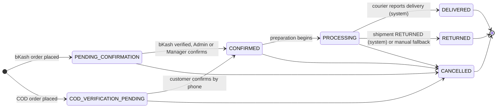
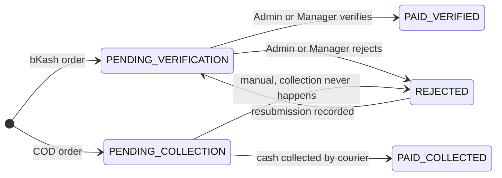
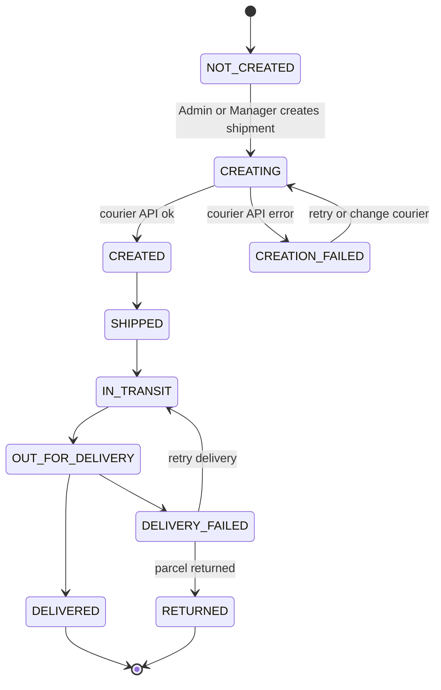
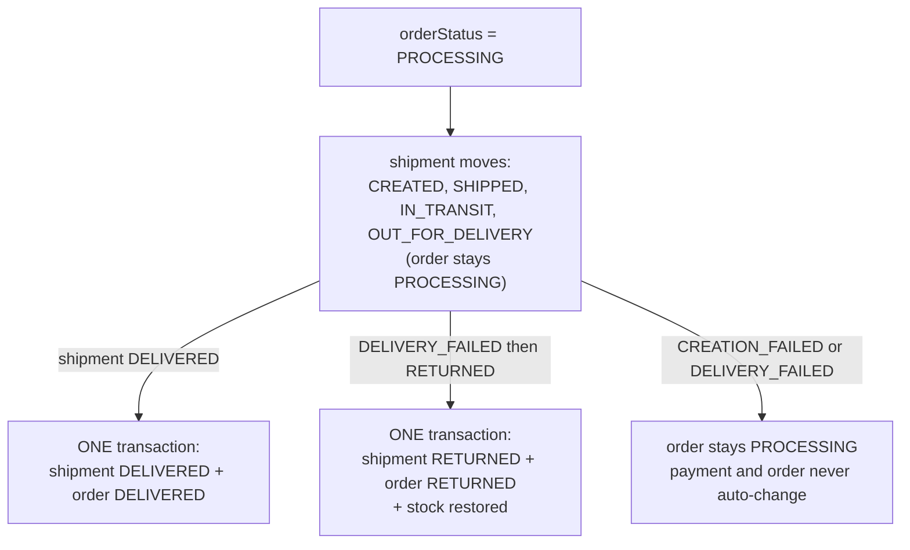

# 01 - Order, Payment and Shipment State Machine

Source: `.claude/project requirment documents/07-order-state-machine.md` (authoritative).
Code: `backend/src/services/orderStateMachine.ts`, `orderStatus.service.ts`, `shipmentStatus.service.ts`.

Three **independent** status fields live on every order. Shipment states (SHIPPED, IN_TRANSIT,
OUT_FOR_DELIVERY) never appear in the order status; the order stays `PROCESSING` while the shipment moves.

## 1. Order status (bKash and COD)

The only difference is the starting status.

Not allowed: `DELIVERED -> CANCELLED`, and any `DELIVERED -> RETURNED` (post-delivery returns are manual in v1).

## 2. Payment status

bKash payments start at `PENDING_VERIFICATION`; COD payments start at `PENDING_COLLECTION`.

A rejected bKash payment does **not** cancel the order. For COD, `DELIVERED` + `PENDING_COLLECTION` can coexist
and is flagged in the Order Panel (computed at display time, not stored).

## 3. Shipment status

## 4. How shipment drives order (atomic cascade)

## 5. Side effects tied to transitions

| Transition | Side effect |
| --- | --- |
| `-> CONFIRMED` | Atomic stock decrement (insufficient stock blocks it); Meta `Purchase` event fires once after commit |
| `-> CANCELLED` | Stock restored; courier `Cancel Shipment` called if shipment is CREATED or later; reason, actor, timestamp stored |
| `-> RETURNED` | Stock restored |
| every change | Row appended to `order_status_history` (+ `audit_logs`) |
