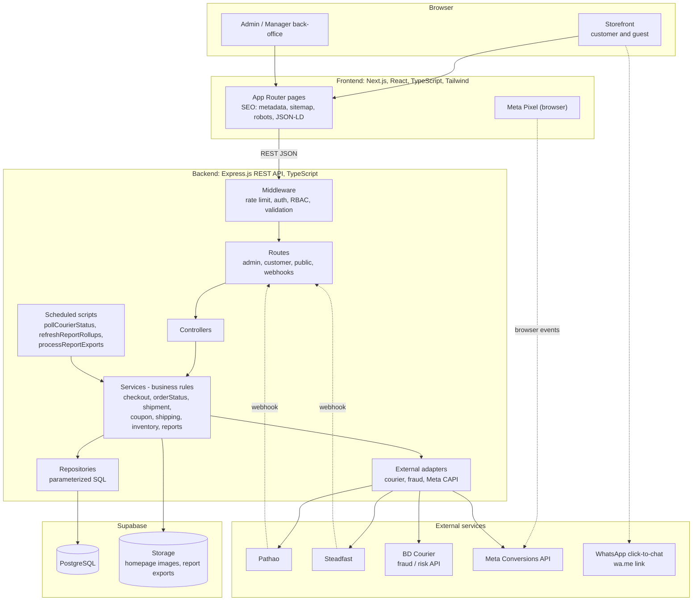
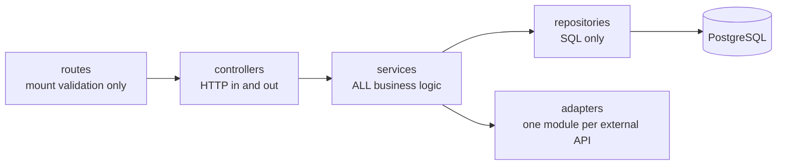
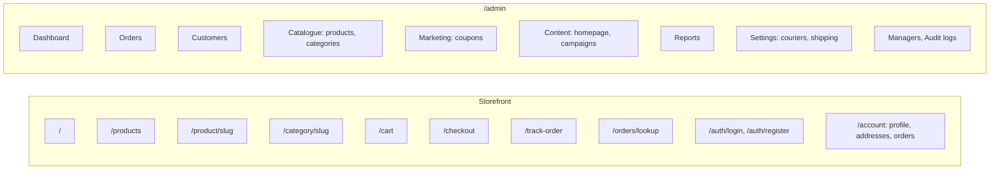

# 02 - System Architecture

Source: `CLAUDE.md` section 3, `backend/src/routes/index.ts`, `backend/src/services/*`.
The Express backend is the business-logic authority. The browser is never trusted for prices, stock, auth or order state.

## 1. High-level components

## 2. Backend layering rule

## 3. Route groups (`backend/src/routes`)

| Mount | Audience | Purpose |
| --- | --- | --- |
| `/api/admin/*` | Admin, Manager | Auth, catalogue, orders, shipments, coupons, CMS, customers, managers, permissions, reports, couriers, shipping, audit logs |
| `/api/customer/auth`, `/api/customer/orders` | Registered customer | Register, login, profile, own orders, place order |
| `/api/products`, `/api/categories`, `/api/homepage` | Public | Browsing and homepage CMS |
| `/api/coupons`, `/api/shipping`, `/api/checkout` | Public (rate limited) | Coupon preview, shipping quote, price preview |
| `/api/orders/lookup`, `/api/track-order` | Public | Guest order lookup, courier tracking |
| `/api/analytics` | Public | Meta events |
| `/api/webhooks/courier/:code` | Courier (signature verified) | Inbound status updates |
| `/api/geography`, `/api/health` | Public | Division/district/upazila data, health |

## 4. Pages (`frontend/src/app`)

## 5. Security boundaries

- Secrets and the Supabase service-role key stay server-side only.
- RBAC is enforced in Express middleware (never RLS, never the frontend).
- Every external call lives in a service adapter; a provider failure never corrupts internal order state.
- Sensitive endpoints are rate limited; uploads are validated; passwords are hashed.
