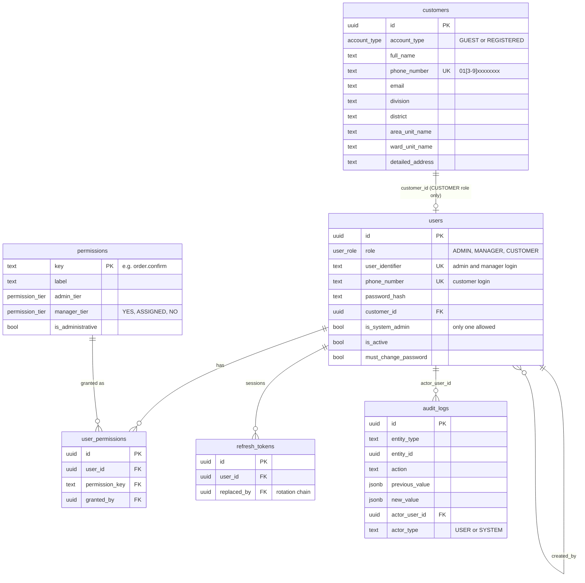
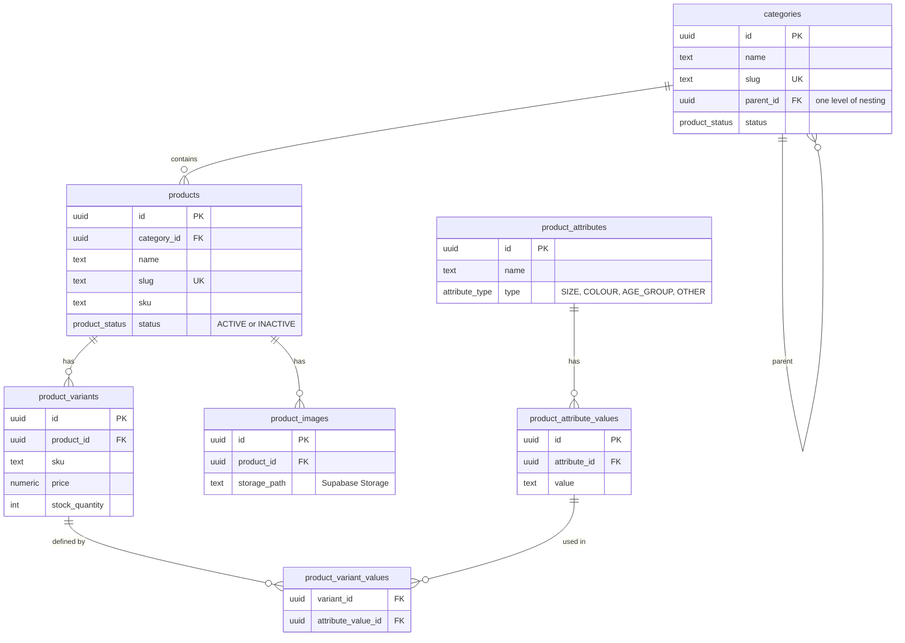
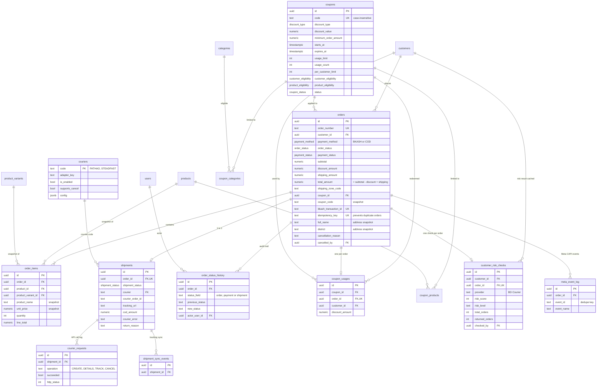
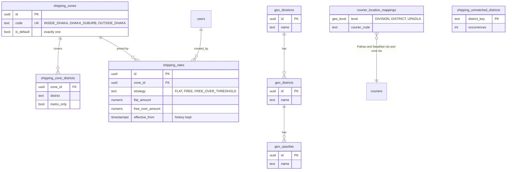
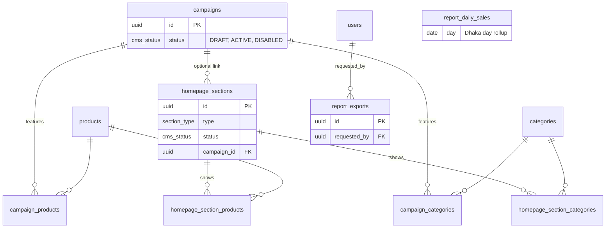

# 03 - Database ER Diagram

Source: `backend/migrations/0001` to `0019` (PostgreSQL / Supabase). Only key columns are shown.
Money columns are `numeric(12,2)`. Enum values are listed in section 6.

## 1. Identity, RBAC and audit

## 2. Catalogue

## 3. Orders, payment, shipment and coupons

## 4. Shipping zones and geography

## 5. Homepage CMS and reporting

## 6. Enums

| Enum | Values |
| --- | --- |
| `user_role` | ADMIN, MANAGER, CUSTOMER |
| `account_type` | GUEST, REGISTERED |
| `order_status` | PENDING_CONFIRMATION, COD_VERIFICATION_PENDING, CONFIRMED, PROCESSING, DELIVERED, CANCELLED, RETURNED |
| `payment_method` | BKASH, COD |
| `payment_status` | PENDING_VERIFICATION, PAID_VERIFIED, REJECTED, PENDING_COLLECTION, PAID_COLLECTED |
| `shipment_status` | NOT_CREATED, CREATING, CREATED, SHIPPED, IN_TRANSIT, OUT_FOR_DELIVERY, DELIVERED, CREATION_FAILED, DELIVERY_FAILED, RETURNED |
| `discount_type` | PERCENTAGE, FIXED_AMOUNT |
| `coupon_status` | DRAFT, ACTIVE, DISABLED |
| `risk_level` | LOW, MEDIUM, HIGH, UNKNOWN, CHECK_FAILED |
| `section_type` | HERO, CATEGORY_GRID, PRODUCT_CAROUSEL, CAMPAIGN_BANNER, PROMO_BANNER, CUSTOM_CONTENT |

## 7. Integrity rules worth knowing

- `orders.idempotency_key` unique: a double-clicked checkout cannot create two orders.
- `orders.bkash_transaction_id` unique: one bKash transaction cannot pay two orders.
- `shipments.order_id` unique: one shipment per order (no duplicate shipments).
- `coupon_usages.order_id` unique: one coupon redemption per order.
- `orders_total_composition_check`: `total = subtotal - discount + shipping`.
- `order_items` stores name and price snapshots, so later catalogue edits never change past orders.
- Only one `is_system_admin` user can exist (partial unique index).
