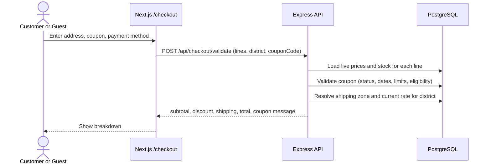
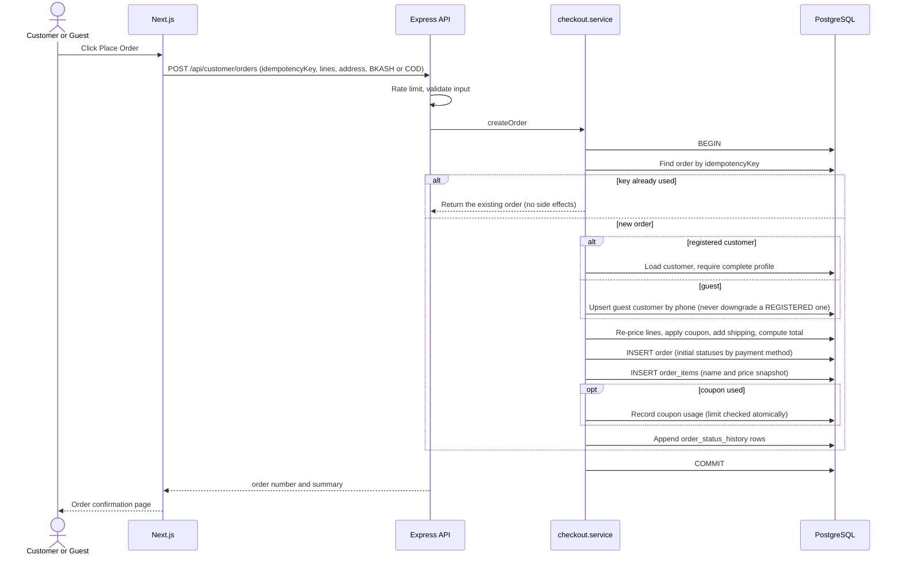
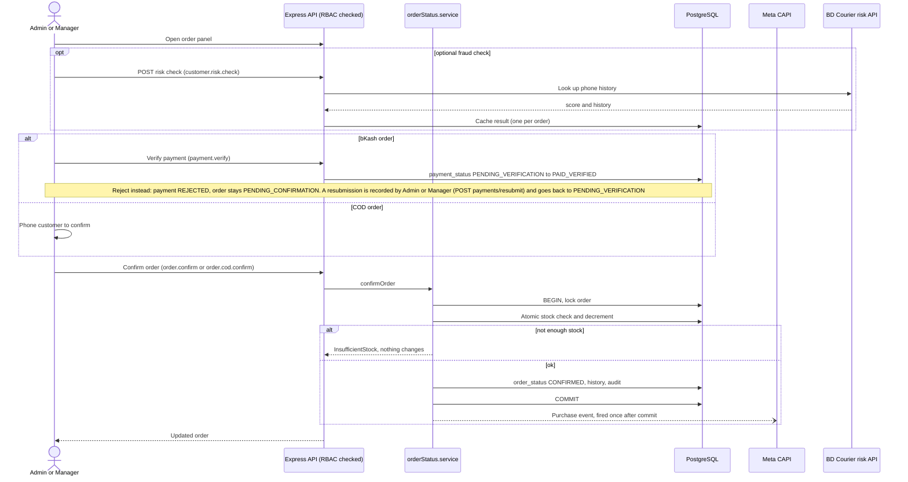
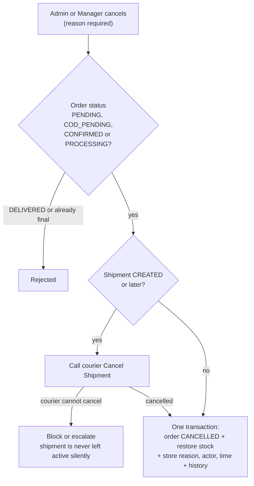

# 04 - Checkout and Order Lifecycle Sequences

Source: `backend/src/services/checkout.service.ts`, `checkoutPricing.ts`, `orderStatus.service.ts`,
`03-payment-order.md`, `10-coupon-discount.md`, `08-analytics-meta.md`, `09-fraud-risk-check.md`.

Key idea: the browser only sends **what** the customer wants (product ids, quantities, address, coupon code).
The backend recomputes every price, discount, shipping fee and total.

## 1. Price preview (before placing the order)

`POST /api/checkout/validate` uses the same `priceCheckout` function as order placement, so the preview and the
real order cannot disagree. It is advisory only.

## 2. Place order

Initial statuses:

| Payment | `order_status` | `payment_status` |
| --- | --- | --- |
| bKash | PENDING_CONFIRMATION | PENDING_VERIFICATION |
| COD | COD_VERIFICATION_PENDING | PENDING_COLLECTION |

Stock is **not** decremented at placement. It is decremented at `CONFIRMED` (spec 07 / 5.1).

## 3. Admin handles the order (bKash and COD)

## 4. Cancellation

## 5. Customer-side views

- Registered customers: `/account/orders` and `/account/orders/[orderNumber]`.
- Guests: `/orders/lookup` (order number + phone) and `/track-order` (courier tracking id).
- All order data shown to the customer is read from the backend; status labels are display text for the stored enums.
