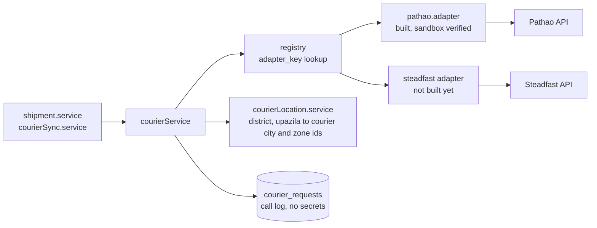
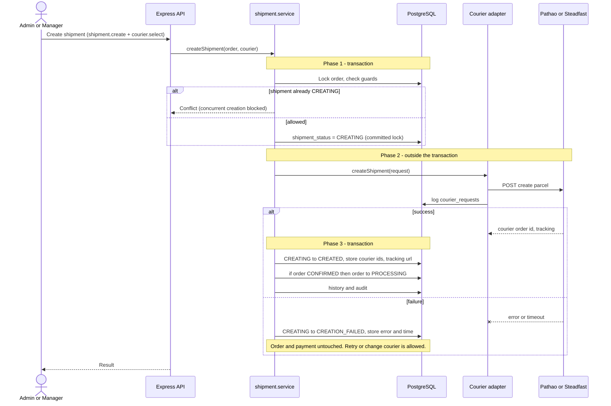
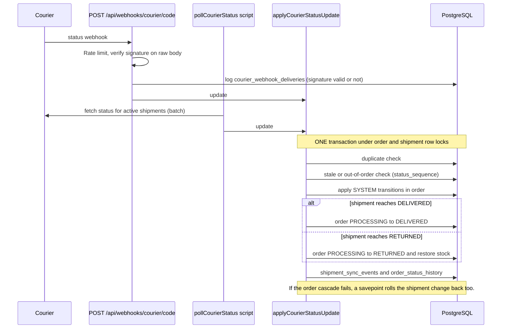
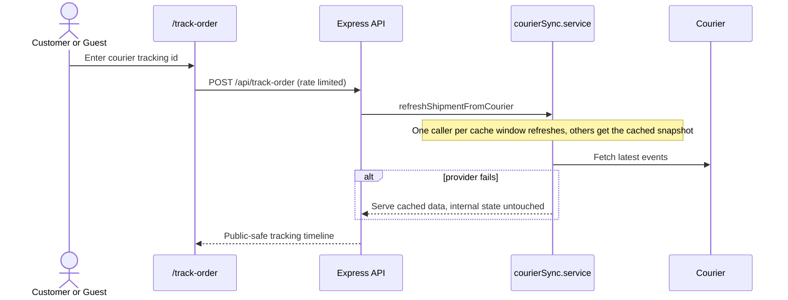

# 05 - Courier and Shipment Sequences

Source: `backend/src/services/shipment.service.ts`, `shipmentSync.service.ts`, `courierSync.service.ts`,
`courier/*`, `controllers/courierWebhook.controller.ts`, `04-courier-shipment.md`.

Design rules:
- One creation path serves create, retry and change-courier, so their guards cannot diverge.
- The committed `CREATING` status is the concurrency lock (no duplicate shipments).
- The courier is called **outside** the DB transaction, so a slow provider never holds a row lock.
- No automatic retry: a timeout might mean the parcel was created.
- A courier failure changes the shipment only. It never rejects payment or cancels the order.

## 1. Courier adapter structure

## 2. Create shipment (also retry and change courier)

## 3. Hand-over to courier

`CREATED -> SHIPPED` is a manual step by Admin/Manager (parcel handed over). Courier sync never does it for them.

## 4. Status sync (webhook and polling share one applier)

Replayed or duplicated updates change nothing. An update needing `CREATED -> SHIPPED` is recorded as
`INVALID_TRANSITION` and applies on a later poll once an admin has marked the parcel shipped.

## 5. Customer tracking

## 6. Failure handling summary

| Failure | Shipment | Order | Payment |
| --- | --- | --- | --- |
| Create call fails | CREATION_FAILED | stays as is | unchanged |
| Delivery fails | DELIVERY_FAILED | stays PROCESSING | unchanged |
| Retry delivery | back to IN_TRANSIT | PROCESSING | unchanged |
| Parcel returned | RETURNED | RETURNED (atomic) | unchanged |
| Courier API down during tracking | cached data served | untouched | untouched |

## 7. Open items (from project notes)

- Steadfast adapter is not built; Pathao has no cancel, webhook or reference-lookup yet and runs on sandbox.
- Migrations 0016 to 0019 may not yet be applied to the real database.
