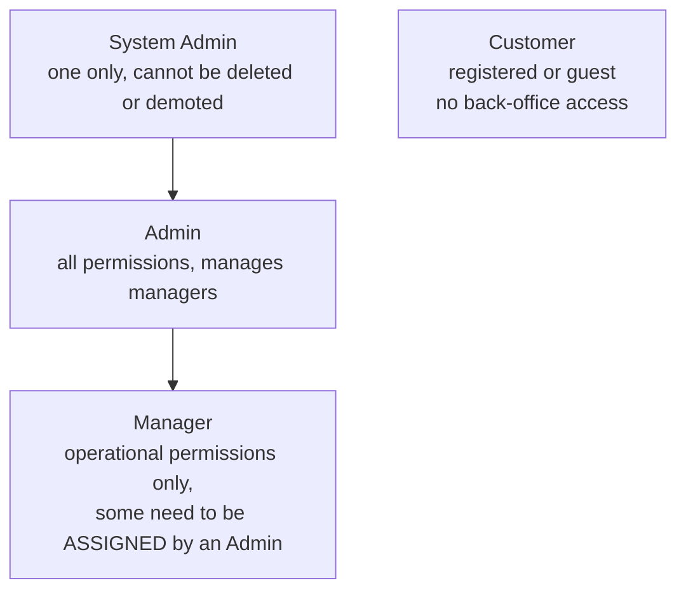
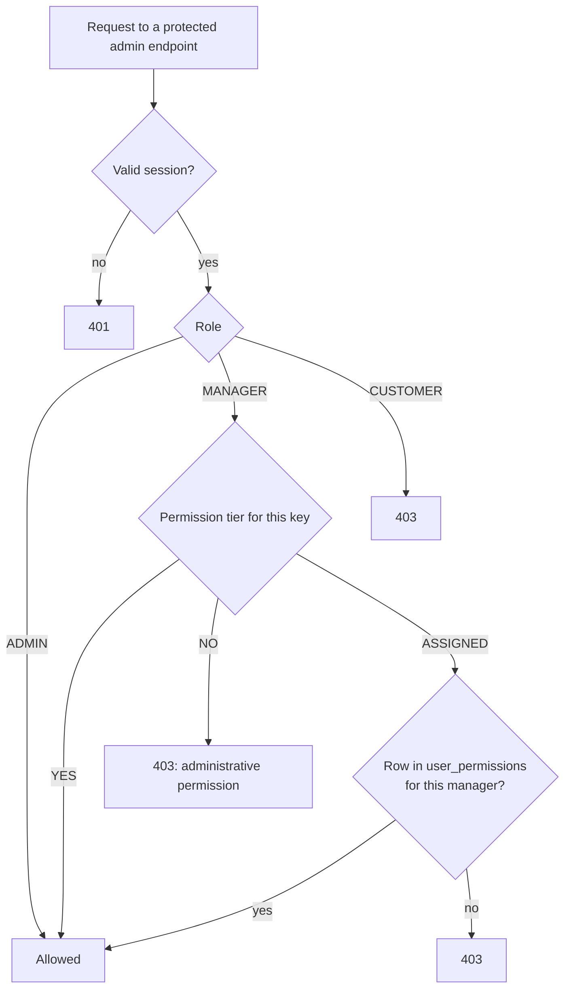
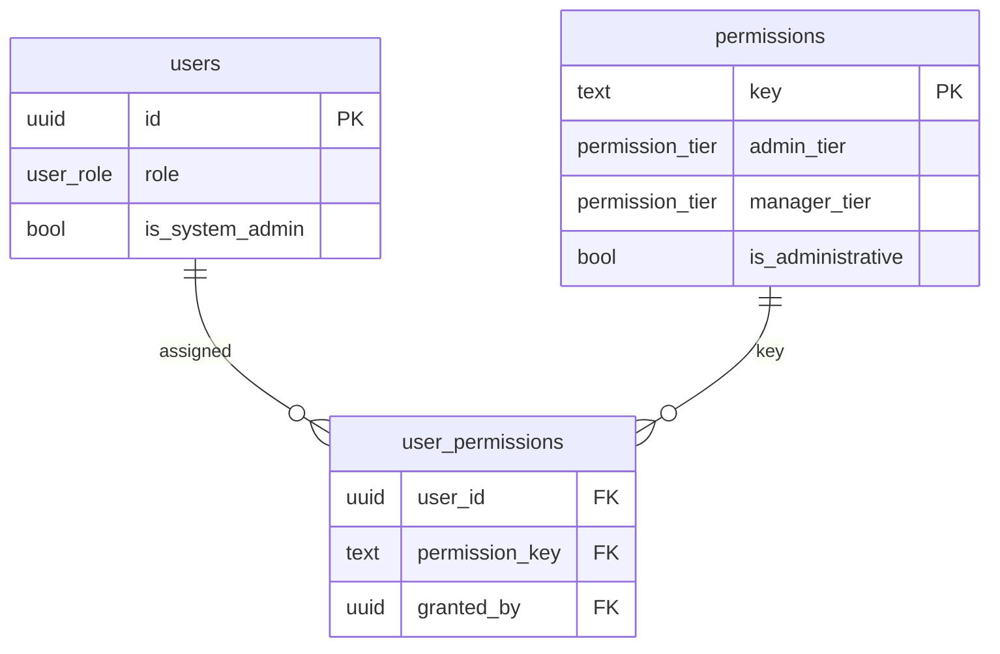

# 06 - RBAC (Roles and Permissions)

Source: `.claude/project requirment documents/06-rbac.md` (section 5.18 matrix), seeded in `backend/migrations/0002`.
RBAC is enforced in Express middleware on every protected endpoint, never in the frontend and never via RLS.

## 1. Roles and hierarchy

## 2. How a permission is decided

- `YES`: every manager has it by default.
- `ASSIGNED`: only managers an Admin has explicitly granted it to (`user_permissions`).
- `NO`: administrative permission, Admin only (`is_administrative = true`).

## 3. Permission matrix (default maximum scope)

| Area | Permission key | Admin | Manager |
| --- | --- | :-: | :-: |
| **Dashboard** | `dashboard.view` | Yes | Yes |
| | `analytics.view` | Yes | Assigned |
| | `audit.view` | Yes | Assigned |
| **Catalogue** | `product.create`, `product.update` | Yes | Yes |
| | `product.delete` | Yes | Assigned |
| | `category.manage` | Yes | Yes |
| | `product.image.manage`, `product.attribute.manage`, `product.variant.manage` | Yes | Yes |
| | `product.price.manage`, `inventory.manage`, `product.visibility.manage` | Yes | Yes |
| **Orders** | `order.view`, `order.confirm` | Yes | Yes |
| | `order.update`, `order.cancel` | Yes | Assigned |
| | `order.cod.confirm` | Yes | Yes |
| **Payments (bKash)** | `payment.view`, `payment.verify`, `payment.reject`, `payment.review` | Yes | Yes |
| **Customers** | `customer.view`, `customer.risk.check` | Yes | Yes |
| | `customer.update` | Yes | Assigned |
| **Shipments** | `shipment.view`, `shipment.create`, `courier.select`, `shipment.track`, `shipment.retry`, `shipment.courier.change` | Yes | Yes |
| | `courier.manage` | Yes | Assigned |
| **Content** | `cms.manage` | Yes | Assigned |
| **Coupons** | `coupon.view`, `coupon.usage.view` | Yes | Yes |
| | `coupon.create`, `coupon.update`, `coupon.status`, `coupon.delete` | Yes | Assigned |
| **Administration** | `user.manager.create`, `user.manager.update`, `user.manager.delete` | Yes | No |
| | `permission.assign`, `role.manage`, `permission.manage` | Yes | No |
| | `system.configure` (also guards shipping zones and rates), `rbac.configure` | Yes | No |

## 4. Data model

## 5. Protection rules

- Only an Admin can create, update, delete managers or assign permissions.
- A Manager can never receive an administrative (`NO`) permission, even by assignment.
- The System Admin account cannot be deleted, deactivated or demoted (partial unique index on `is_system_admin`).
- Admin and Manager sessions use refresh-token rotation (`refresh_tokens`); a newly created manager must change the password on first login.
- Permission and role changes are written to `audit_logs`.
