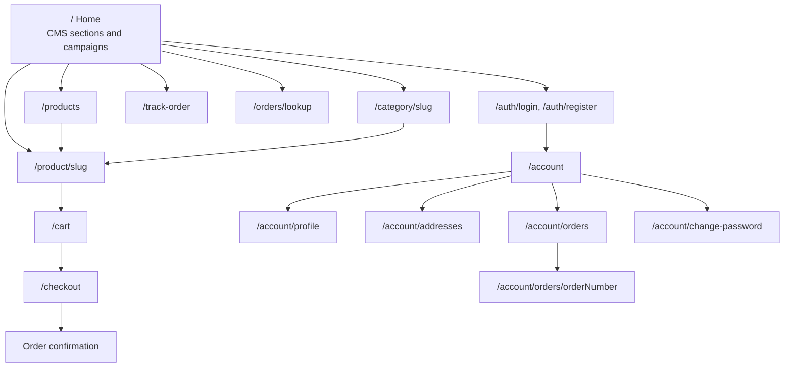
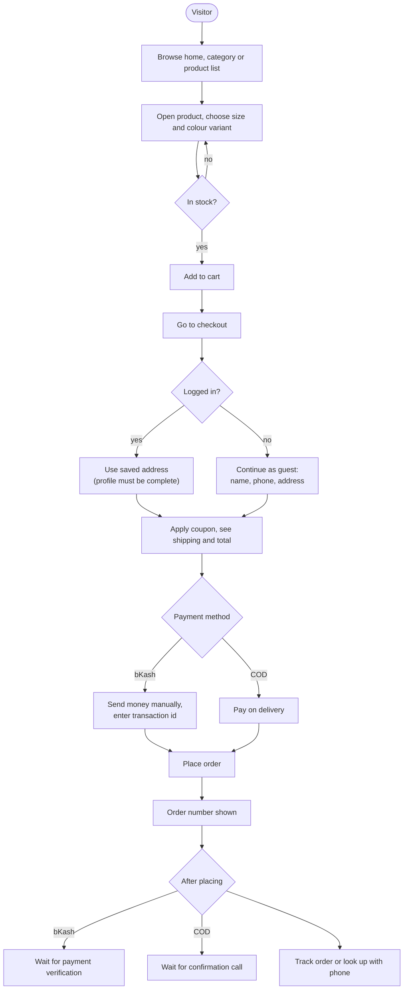
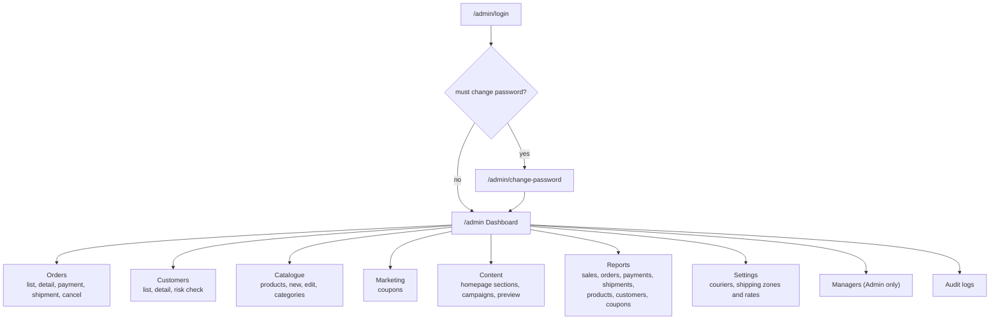
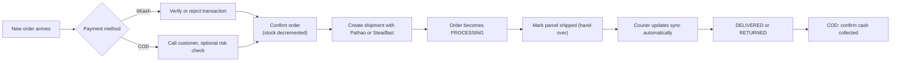

# 07 - User Flows and Sitemap

Source: `frontend/src/app` (real routes), `02-customer.md`, `13-homepage-cms.md`.

## 1. Storefront sitemap

Also present: `sitemap.xml`, `robots.txt`, WhatsApp click-to-chat button, Meta Pixel PageView.

## 2. Customer purchase journey

## 3. Guest versus registered

| Capability | Guest | Registered |
| --- | :-: | :-: |
| Browse and buy | Yes | Yes |
| Saved address and profile | No | Yes |
| Order history page | No | Yes |
| Look up order by order number and phone | Yes | Yes |
| Track by courier tracking id | Yes | Yes |
| Coupons marked "registered only" | No | Yes |

A guest is stored as a `customers` row with `account_type = GUEST`. Registering later reuses the same phone-number record.

## 4. Admin back-office sitemap

Menu items are shown or hidden by permission, but the backend re-checks every call.

## 5. Admin daily order routine

