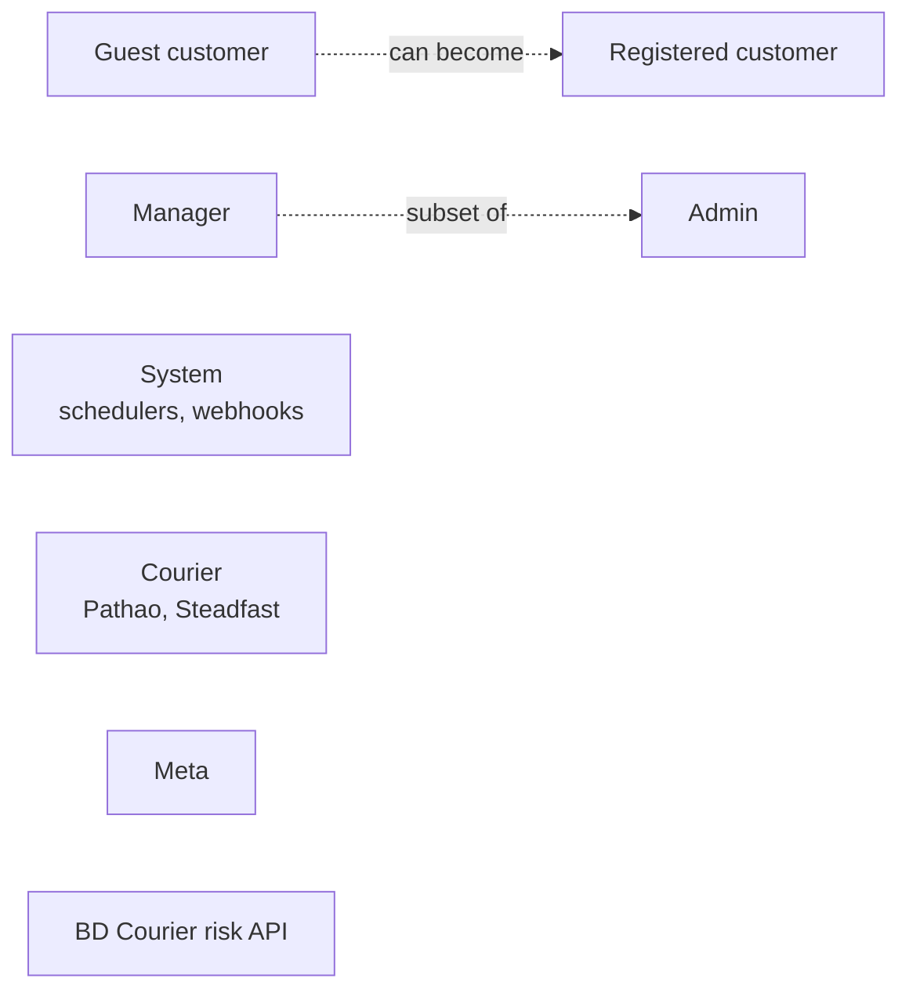
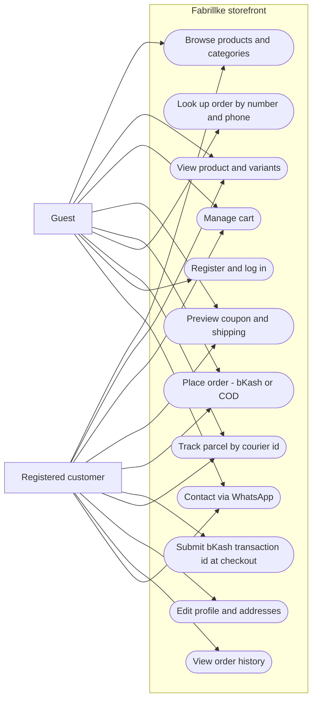
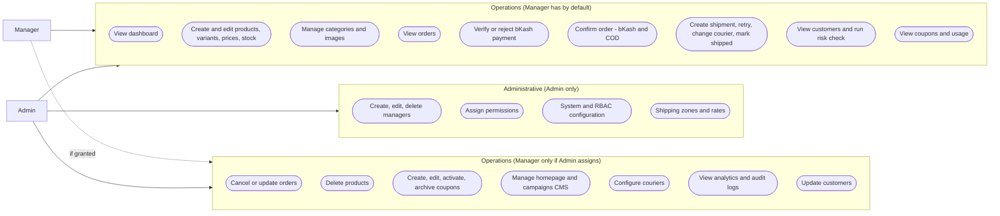
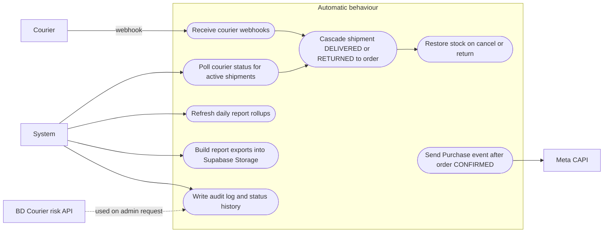

# 08 - Use Cases (Who Can Do What)

Source: requirement docs 02 to 13 and `backend/src/routes`. Permission keys are in `06-rbac.md`.

## 1. Actors

## 2. Storefront use cases

## 3. Back-office use cases

Shipping zone and rate management requires `system.configure`, so it is Admin only (`routes/admin/shipping.routes.ts`).

## 4. System and external use cases

## 5. Use case index

| # | Use case | Actor | Main spec |
| --- | --- | --- | --- |
| 1 | Browse and search catalogue | Guest, Customer | 02, 13 |
| 2 | Place bKash or COD order | Guest, Customer | 03 |
| 3 | Apply coupon | Guest, Customer | 10 |
| 4 | Track or look up an order | Guest, Customer | 02, 04 |
| 5 | Verify or reject bKash payment | Admin, Manager | 03, 07 |
| 6 | Confirm order | Admin, Manager | 07 |
| 7 | Create shipment and manage courier | Admin, Manager | 04 |
| 8 | Fraud / risk check | Admin, Manager | 09 |
| 9 | Manage catalogue | Admin, Manager | 05 |
| 10 | Manage coupons | Admin, Manager (assigned) | 10 |
| 11 | Manage homepage CMS | Admin, Manager (assigned) | 13 |
| 12 | Manage managers and permissions | Admin | 06 |
| 13 | Reports and exports | Admin, Manager (assigned) | 05 |
| 14 | Meta Pixel and CAPI tracking | System | 08 |
